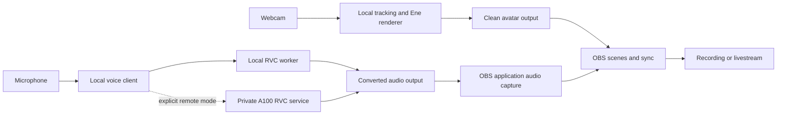

# Live English character voice: research and implementation design

Status: implementation in progress; research and implementation checkpoint 2026-09-12. The pinned local toolchain, three reference auditions, Voice Studio and separate OBS audio routes are installed. RVC benchmarks have not met live performance gates. An isolated LLVC streaming adapter matches its upstream model exactly; paced and combined validation remain open. See the [current delivery evidence](../reports/acceptance.md), [voice measurements](../reports/voice-performance.md), [LLVC experiment](../reports/voice-llvc-plan.md) and [TASK-P02](../tasks/active/TASK-P02.md). Physical microphone quality/latency and the user's preferred voice remain unaccepted; no remote machine has been accessed.

This adds **G3: live character voice and voice auditions** to the [Ene VTuber plan](ene-vtuber-plan.md). The user wants to speak English with a cheerful feminine anime-style voice while performing as Ene, and compare other voice types. An exact existing character impression is unnecessary. [Implementation backlog](../tasks/backlog/README.md): TASK-022 through TASK-028; TASK-021 remains the final combined handoff.

## Recommendation

Use **RVC v2 through w-okada VC Client**, initially as a separate voice process. Compare the **deiteris RVC-only fork** on this Intel laptop if upstream performs poorly. Use **Applio** for training and file-based auditions; evaluate its live mode only if it improves the measured result. Keep the avatar renderer independent of audio inference. RVC and both client repositories publish MIT licenses; Applio also publishes MIT. Pin a tested source revision and build instead of following old tutorial binaries. [RVC license](https://github.com/RVC-Project/Retrieval-based-Voice-Conversion-WebUI/blob/main/LICENSE), [w-okada license](https://github.com/w-okada/voice-changer/blob/master/LICENSE), [deiteris license](https://github.com/deiteris/voice-changer/blob/master-custom/LICENSE), [Applio license](https://github.com/IAHispano/Applio/blob/main/LICENSE).

Start with local CPU inference, then benchmark ONNX/DirectML as an experiment. The available **A100 is a useful fallback for inference and training, not a requirement**. Choose remote inference only if the entire microphone-to-return-audio path passes the same usability gate as local operation. For a single RVC voice, an A100 is likely more compute than necessary; this is an engineering inference, not an A100 benchmark.

There is a strong engine recommendation, but **no verified winner for cheerful English anime speech** from this research. Audition an explicitly licensed original-character pack and a natural English feminine baseline. Select the final voice from recordings of this user's speech; prepare an original English voice if public checkpoints fail. Do not label a Japanese demo or an attractive model name as proof of English quality.

## What the community actually recommends

Public Reddit threads and GitHub discussions were read in parallel with official documentation. These are qualitative reports, not controlled benchmarks or a vote-based ranking. Closed Discord archives were not accessed. Dates below describe posts, not software versions.

| Source | Report | Design consequence |
| --- | --- | --- |
| [w-okada VTuber dual-PC discussion](https://github.com/w-okada/voice-changer/discussions/1453), February 7-8, 2025 | A streamer reports breakup when RVC, OBS, avatar tools and demanding games share an RTX 4080 machine; another participant suggests separating conversion | Measure simultaneous workloads; buying a larger GPU alone does not prove a working stream |
| [English w-okada experiences](https://www.reddit.com/r/TransVoicechangers/comments/1o11ksk/w_okada/), October-December 2025 | Satisfied and dissatisfied users report very different delay on powerful GPUs; English-trained voices are recommended over defaults | Test English material and actual audio delay; hardware labels and inference counters are insufficient |
| [Feminine voice recommendations](https://www.reddit.com/r/transgamers/comments/1ek0yqn/recommendations_for_a_voice_changer_that_isnt/), August 2024 and later replies | Several users recommend w-okada, while others cannot get convincing results; one shares a roughly 500 ms chunk setting | Provide repeatable auditions and tuning; shared presets are starting experiments, not universal defaults |
| [w-okada introduction thread](https://www.reddit.com/r/TransVoicechangers/comments/156y1g0/intro_to_wokada_voice_changer/), July 2023 and later replies | A user reports weaker English results from Japanese-trained voices; later replies point to deiteris | Include language fit and an alternate RVC client in the comparison |

Community enthusiasm supports trying RVC first. It does not substantiate an effortless transformation, a specific laptop latency, or the licensing of downloaded performer/character models. Technical decisions below rely on the projects' own documentation.

## Engine comparison and open-source boundary

| Option | Verified technical/source finding | Decision |
| --- | --- | --- |
| w-okada + RVC v2 | Live client, replaceable voice models, local or separate-server operation; CPU and ONNX/DirectML paths documented | Primary live kit; provision only the audited RVC dependency set, excluding optional restricted engines and sample packs. [Official README](https://github.com/w-okada/voice-changer/blob/master/README_en.md) |
| deiteris voice-changer | RVC-only fork; documents CPU requirements and explicitly warns that Intel integrated GPUs perform poorly | CPU comparison candidate; Iris Xe acceleration is not assumed. [Official requirements](https://github.com/deiteris/voice-changer#system-requirements) |
| Applio | MIT voice-conversion project with training and inference tooling | Preferred training/audition workbench; preserve compatible RVC exports. [Repository](https://github.com/IAHispano/Applio) |
| Beatrice 2 | Trainer source and its pretrained models are MIT. However, standard clients/VST use a non-public inference library with separate permission conditions | Exclude the standard runtime from this strictly open-source baseline. An independently open inference implementation would need a new review; do not call the whole stack MIT. [Trainer license section](https://huggingface.co/fierce-cats/beatrice-trainer#license), [VST bundled license](https://github.com/prj-beatrice/beatrice-vst/blob/main/LICENSES_BUNDLED.txt), [client conditions](https://github.com/aq2r/beatrice-client#license---beatrice) |
| Seed-VC | GPL-3.0 code; short-reference zero-shot conversion. Author describes roughly 300 ms algorithm delay plus 100 ms device delay; repository archived November 21, 2025 | Optional A100 file-audition experiment. Not the first live implementation: network overhead adds to its existing buffering, and maintenance is a concern. Check each weight's terms separately. [Repository](https://github.com/Plachtaa/seed-vc) |
| LLVC | MIT research code for CPU streaming conversion; custom voices require a training/data pipeline | Bounded CPU fallback investigation if RVC fails, not a plug-in replacement for arbitrary RVC checkpoints. [Code and workflow](https://github.com/KoeAI/LLVC), [license](https://github.com/KoeAI/LLVC/blob/main/LICENSE) |

An open-source client does not make every bundled checkpoint open. Track code, content encoder, pitch estimator, pretrained generator, target weights, training data, and artwork separately. Only explicitly licensed target weights enter the curated catalog. Keep unfamiliar downloaded checkpoint loading isolated from credentials and the avatar source tree; pin origins and hashes. Do not silently substitute a closed inference DLL or proprietary audio-routing tool to close an open-source acceptance criterion.

## Voice shortlist and audition design

| Candidate | Evidence and availability | Role |
| --- | --- | --- |
| CHIHAYA Friendly Girl V2: `V2-AISO-SYAKITTO.pth`, `V2-AISO-HOWATTO.pth`, `V2-AISO-KAKKOII.pth` | Creator offers crisp, soft and cool styles, plus smooth and mellow variants; states MIT for weights/index/samples/icons and describes a composite of consenting speakers. Japanese examples; documented no-F0 models with index ratio 0 and approximately 1.5-2 second buffering | Strongest explicit-license original-character audition pack found. Try crisp for cheerful and soft/cool as contrasts; these are style hypotheses, not listening results. Long-buffer settings fail our live gate; test shorter settings and reject for live use if quality collapses. [Creator documentation](https://note.com/aisoiikei_turuno/n/n262c358700a5), [distribution](https://chihaya369.booth.pm/items/4701666) |
| A project-trained English feminine baseline from LJ Speech | Dataset publisher identifies Linda Johnson's English narration and public-domain data; no checkpoint is being claimed as already trained | Reproducible natural-voice control, not a ready-made cheerful character. Train a small baseline if no suitable licensed English checkpoint is available. [Dataset](https://keithito.com/LJ-Speech-Dataset/) |
| LUNAR English female RVC | Publisher tags it MIT and English, but files require gated access and provenance detail is limited | Reserve candidate; not a bundled default or verified quality claim. Do not make setup depend on an account/contact-information gate. [Model card](https://huggingface.co/IssacMosesD/Lunar-RVC-Model) |
| Original expressive English voice | Record a willing performer or use suitable explicitly licensed expressive speech, with a documented training and weight-distribution grant | Best route if ready-made voices miss the intended character. A100 training is conditional, with a first experiment using 10-30 minutes of clean, varied speech. RVC recommends at least ten minutes of low-noise material. [RVC guidance](https://github.com/RVC-Project/Retrieval-based-Voice-Conversion-WebUI/blob/main/docs/en/README.en.md) |

The first audition set should contrast **bright/cheerful**, **soft/gentle**, **cool/lower**, and **natural feminine**. At least three must be meaningfully different timbres, not just three pitch offsets. No need to reproduce Ene's canonical voice. The original-character pack provides immediate candidates, while the English baseline gives a control if cross-language conversion struggles.

Record one 60-90 second English passage locally, then reuse it for fair A/B comparison. Include these original lines, spontaneous speech, a laugh, a quiet phrase, and a comfortable excited reaction:

> Hey everyone! I'm so glad you're here. Let's try something fun today!
>
> Wait, really? That actually worked! Okay, one more try.
>
> Three tiny robots brought fresh strawberries, blue ribbons, and twelve little bells.
>
> I think we should take the left path. What do you think?

Test normal comfortable delivery and a more expressive delivery separately. Treat conversion primarily as timbre conversion; cheerful intent also depends on the operator's rhythm, emphasis and inflection. Avoid assuming a pitch increase creates the right character. Match playback loudness for judging; preserve unnormalized originals for artifact analysis. Audition pitch shifts such as 0/+4/+8/+12 semitones only for models that support F0 control; use smaller shifts or negative values if the user's input range warrants them. Do not apply RVC pitch/index controls to no-F0/dummy-index models as if they worked identically.

Score English intelligibility, character fit, naturalness, effort, laughter/quiet-speech behavior and artifacts from 1-5. Then hold a live conversation with the best two: a polished file conversion does not prove live usability. Store ratings and the user's preferred voice; subjective selection remains open until the user has heard the auditions. A voice should average at least 4/5 for intelligibility and character fit before being labeled the default; a rejected set triggers the conditional training task.

## Laptop versus A100

Local read-only CIM inspection confirmed an **ASUS ExpertBook B1402CBA**, **Intel Core i7-1255U (10 cores/12 logical processors)**, **16,779,812,864 bytes RAM (about 15.6 GiB)**, and **Intel Iris Xe**, driver **31.0.101.4255**. No NVIDIA device was detected. This agrees with the existing avatar plan. Microphone quality, audio-device buffer behavior, available disk space and thermal headroom remain unmeasured. The A100's OS, allocation, host CPU, driver, endpoint and network RTT are unknown; user-reported access is not a verified connection.

| Path | Expected use | What decides it |
| --- | --- | --- |
| Laptop CPU RVC | First experiment; convenient offline operation | Full voice + webcam tracking + Ene rendering + OBS benchmark, including thermal behavior |
| Laptop ONNX/DirectML | Optional comparison | Confirm the exact exported generator and pitch/content paths actually use supported providers; Intel iGPU shares resources with the renderer |
| Remote A100 RVC | Fallback when local conversion competes with tracking/rendering | Same end-to-end audio gates, including network transport, jitter and reconnection |
| A100 training, laptop inference | Preferred use of remote capacity when a custom voice is necessary | Audition and local performance of the resulting compatible RVC checkpoint |
| Remote/offline higher-quality conversion | Optional short-video postproduction | Useful experiment, but does not close G3's live-speaking requirement |

Use **latency = capture buffer + input chunk/lookahead + transport + inference + overlap/output buffer + playback/capture routing**. Network ping is only a lower-bound clue; it excludes audio framing and server queues. Inference faster than real time does not prove low end-to-end delay. Larger chunks may reduce glitches while making conversation worse.

Test converter alone first, then the actual 720p/30 avatar and OBS workload. Sweep approximately 40/80/160/320 ms chunks where supported, recording actual milliseconds rather than copying client-specific numeric units. Stop reducing buffers once speech breaks. Record p50/p95 end-to-end delay, p95 compute time per chunk, CPU/RAM/provider, audio discontinuities, renderer frame intervals and OBS drops.

Proposed gates, not measured results: aim for median audio delay at or below **200 ms**; require **p95 at or below 350 ms** and p95-minus-median at or below **100 ms** for the selected conversational preset, together with user acceptance. A setup above 500 ms is unsuitable as the default conversation preset. Intermediate failures stay open for tuning; a broadcast-only mode must be labeled as such. Require no audible breakup in a five-minute speech test, no queue growth or crash in a thirty-minute combined session, and the existing avatar frame-time gates. Check lip/audio residual offset within **80 ms** in final recordings.

Measure raw input and converted return on separate tracks of the same recording clock for a deliberate test; align repeated speech onsets and document uncertainty. Do not infer acoustic input-to-output latency solely from correlation of transformed waveforms or a GUI counter. Use an external recording/loopback calibration where possible. Keep raw audition/test tracks local and out of normal broadcast profiles.

## Integration architecture

The voice client owns microphone capture. The existing avatar page still owns only the camera; it does not need a second microphone capture or cloud tracking. Put voice controls in the kit through a small versioned adapter after the chosen client is proven. First deliver a reliable launcher and native client presets; avoid coupling the renderer to undocumented internal audio APIs.

**Windows OBS baseline:** play converted audio from an isolated voice-client process/browser instance and capture that application's audio in OBS. Disable the scene's direct raw microphone and duplicate desktop-audio capture. Use headphones for setup and monitoring; make monitoring switchable through a tested route without muting the stream source. If process isolation or mute behavior breaks capture, deliver a small open-source PCM-to-OBS audio source/bridge in the routing task. Do not assume a hidden browser tab can safely isolate every tab's audio. OBS documents application capture on Windows 11 and notes application compatibility exceptions. [OBS application audio guide](https://obsproject.com/kb/application-audio-capture-guide).

**Lip sync:** keep camera mouth tracking. Measure whether audio or video arrives first and delay the faster path. If voice is late, delay the captured avatar video using a tested OBS filter or bounded timestamped output buffer; a positive audio sync offset would make it worse. Store offsets per backend/preset, verify both orientations, and invalidate them when buffers change. Sync correction cannot remove conversational delay, and a constant offset cannot fix unstable network jitter.

**Virtual camera and voice chat:** OBS Virtual Camera supplies video, not a microphone. The required G3 baseline is converted voice in recordings/livestreams. Investigate an additional open-source virtual-microphone route for call applications as a bounded compatibility extension. Windows alternatives such as Synchronous Audio Router and VirtualDrivers require careful build/signing/compatibility checks; do not promise a working cable from a device name alone. Do not require test-signing or disabling Secure Boot as part of normal kit setup. If none works, report the external-call limitation while retaining the driver-free OBS path. [OBS Virtual Camera](https://obsproject.com/kb/virtual-camera-guide), [SAR](https://github.com/eiz/SynchronousAudioRouter), [VirtualDrivers current README](https://github.com/VirtualDrivers/Virtual-Audio-Driver). VB-CABLE is not selected as an open-source dependency.

**Remote mode:** reuse the chosen client's supported client/server audio transport before inventing one. Keep microphone capture and returned playback on the laptop: the A100 has no assumed local audio device. Run inference behind a private authenticated SSH tunnel or equivalent authenticated encrypted connection, with loopback-bound service ports; no public unauthenticated endpoint or mandatory tunnel SaaS. Preserve sequence numbers/timestamps, bounded buffers and a stale-audio cutoff. If the supplied transport cannot recover predictably, measure the necessary adapter work before committing to remote as the default. Use remote mode only when explicitly selected; show the active backend and disconnect state. Transmit audio only; camera/tracking remain local. Do not save remote microphone audio by default.

**Failure and switching:** mute on worker crash, missing checkpoint, backend timeout, or preset change; never automatically route the unconverted microphone into the stream. Make natural-voice bypass an explicit action. Warm the next preset where memory permits, flush stale buffers, switch at a speech pause, and expose Ready/Loading/Muted/Error states. Stop releases devices and child processes. A100 unavailability must not prevent ordinary local avatar startup.

## Profiles, artifacts and delivery

A versioned `VoiceProfile` records display name/style/language, backend and engine revision, model/index hashes and compatibility, provider, sample rates, F0 mode and supported pitch controls, retrieval ratio, chunk/context/crossfade values, input/output gains, audio-device selection, sync offset, monitoring mode, and license/source references. Store secrets separately. Reject incompatible profiles clearly; schema changes require migration or an explicit reset.

Planned outputs (not created by this research):

- `ops/001-zhil/sprint-001/reports/voice-toolchain.md` and `voice-models.md`: exact builds, component terms, checkpoint provenance and verification.
- `ops/001-zhil/sprint-001/reports/voice-auditions.md` and `voice-performance.md`: audition ratings and measured local/remote comparison.
- `assets/voices/manifest.json` and local excluded checkpoint directory: reproducible provisioning with hashes and notices.
- `src/voice/`: small control adapter and validated profile schema after the implementation language/API decision.
- `docs/voice-quickstart.md`, `docs/voice-troubleshooting.md`, and OBS profile/scene guidance.
- Local audition audio and final clips outside code distribution; do not expose training data or recordings through the web server.

| Requirement | Acceptance evidence | Tasks |
| --- | --- | --- |
| G3-A open source | Reproducible approved code/inference/routing stack and separately recorded weight terms | 022, 025 |
| G3-B English cheerful voice | User-selected preset, intelligible live English and expressive reaction recording with Ene | 023, 027, 028 |
| G3-C experimentation | At least three distinct timbres, saved settings, A/B playback and reliable switching | 023, 026 |
| G3-D feasible hardware | Measured laptop verdict; remote comparison if needed; same complete-workload gates | 024, 028 |
| G3-E production audio | Portrait and landscape clips contain converted speech, measured lip sync, no duplicate/raw mic | 025, 028 |
| G3-F everyday operation | Launcher, mute/recovery, beginner workflow; offline local mode or explicitly identified remote-voice requirement | 026, 028 |

Voice research and auditions can proceed alongside Ene preparation. TASK-022 starts independently; TASK-024 uses TASK-003's working avatar feasibility setup; TASK-025 joins the existing OBS branch. TASK-027 must record either the trained voice or why training is unnecessary. TASK-028 verifies G3 before the expanded TASK-021 handoff. No model preference or performance gate is marked passed merely because this plan exists.

Additional planning estimate: **9-17 focused engineering days**, plus **2-5 days if custom voice training is needed** and any time obtaining suitable recordings. Driver development is not included; the primary OBS route avoids that dependency. Update estimates after the first local benchmark and audition. No A100 rental, hardware purchase or paid voice pack is proposed.
