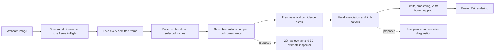

# VModel tracking research and diagnostics

Date: 2026-10-04. Status: research and proposed design. This document does not change tracker behavior.

First, make the tracker results visible. VModel already detects the body and hands and has limb solvers. The reported head-only movement has several possible causes. These include missing, slow, stale, or rejected observations and retargeter errors. Ene alone cannot show which stage causes the problem. Add a camera overlay and a separate skeleton inspector before changes to cameras or solvers.

This research uses the current source and primary online documents. It does not include the user's webcam session or movement. It does not identify one root cause. **Confirmed** means the source shows the behavior. **Hypothesis** means that measurements are necessary. Source line numbers can change.

## Current app behavior

| Confirmed behavior | Why it matters | Source |
| --- | --- | --- |
| One worker runs Face, Pose Lite, then Hands synchronously; GPU initialization falls back to CPU. | A responsive renderer does not imply fast tracking. A slow task delays the whole frame result. | [tracking.worker.ts](../../src/tracking.worker.ts), lines 12–43 and 55–73 |
| Admission spacing is at least 50 ms in balanced and 100 ms in low mode. One frame can be in flight. Pose and hands run every second or third admitted frame. | Scheduling limits are near 20/10 Hz for face and 10/3.3 Hz for pose and hands. Inference and other work lower these rates. These are limits, not measurements. | [camera.ts](../../src/camera.ts), lines 73–98; [tracking.worker.ts](../../src/tracking.worker.ts), lines 57–67 |
| Samples retain their original acquisition timestamps when cached. The retargeter rejects samples aged 500 ms or more. | Fresh face results can coexist with stale cached body/hands. An inference result can arrive already too old. | [tracking.worker.ts](../../src/tracking.worker.ts), lines 60–73; [retarget.ts](../../src/retarget.ts), lines 17, 118–121, 147, 159–166 |
| A limb requires all three shoulder/elbow/wrist or hip/knee/ankle points to pass finite-value, visibility, and presence checks greater than 0.55. | A detected person is insufficient to drive an arm; one weak elbow discards that limb's goal. Missing confidence values default to 1, so absence of a field is not evidence of certainty. | [retarget.ts](../../src/retarget.ts), lines 9, 102–115 |
| Default mode is seated. Legs, standing pelvis motion, and root translation are conditional on standing. Arms are not conditional on standing. | Still legs/root can be intended behavior. Seated mode does not explain still arms. | [types.ts](../../src/types.ts), lines 34–36; [retarget.ts](../../src/retarget.ts), lines 132–145, 215–230 |
| Detailed hands require the hands setting, recent observations, hand-to-body association, and a valid palm frame. | A hand detector result can be present but rejected before fingers are driven. Wrist fallback can still use pose landmarks. | [retarget.ts](../../src/retarget.ts), lines 143–155; [retarget-math.ts](../../src/retarget-math.ts), lines 46–65, 89–139 |
| Each new frame clears goals and rebuilds them. Missing goals relax toward a fallback posture. | Repeated rejection can look like a permanently idle avatar rather than an obvious tracking error. | [retarget.ts](../../src/retarget.ts), `update`, goal rebuilding and missing-goal fallback |
| Head rotation is neutral-relative, clamped, then exponentially smoothed. Default response speed is 14. | Head stiffness can have a separate cause from missing limbs. Raising “Response speed” reduces smoothing lag; the variable name `smoothing` can obscure that direction. | [retarget-math.ts](../../src/retarget-math.ts), lines 30–38; [retarget.ts](../../src/retarget.ts), lines 11, 169, 183–200 |
| Worker output includes pose image/world landmarks and hand image/world landmarks, but discards face landmarks after deriving presence, blendshapes, and matrix. | Most of a neutral body/hand viewer is already supported. A face overlay needs an additional result field. | [types.ts](../../src/types.ts), lines 1–17; [tracking.worker.ts](../../src/tracking.worker.ts), lines 55–73 |

The **Face and body found** message shows task presence and freshness. It does not show accepted arm or finger goals. FPS measures rendering. The inference time belongs to the most recent worker frame. That frame can omit pose and hands. These values do not show the limb update rate. See [main.ts](../../src/main.ts), `getStats`, and the `seen`/status logic.

The historical [positive-photo report](../reports/tracking-positive-fixture.md) gives warm full-task medians of 104–156 ms on GPU. Its CPU medians are 255–351 ms. The tests used a small set of still photos. They did not include a live camera, avatar rendering, or OBS. They do not measure physical motion or sustained speed on the current computer. The report also describes a timestamp overflow. The worker now uses a session-relative SDK clock, so that incident is fixed.

## Hypotheses and tests

Priority gives the test order. It does not give probability.

| Priority / hypothesis | Evidence and uncertainty | Experiment that distinguishes it | Improvement if confirmed |
| --- | --- | --- | --- |
| 1. Camera framing, occlusion, or insufficient detail prevents usable limbs. | A face-close webcam can omit wrists, elbows, hips, or hands below a desk. Pose presence does not prove these individual landmarks are reliable. The actual camera view is unknown. | Overlay raw points and confidence while moving each visible arm separately. Compare face-close, seated upper-body, and standing full-body framing in good light; record actual capture dimensions. | Framing guidance based on missing joints, better camera position/light, and selective higher-resolution or region processing. Avoid requiring visible hips merely to animate a good arm. |
| 2. Body/hands are too slow or stale. | Source establishes lower cadence and a 500 ms gate; the historical report indicates substantial positive-detection cost. | Log acquisition-to-receipt age, unique sample timestamps, actual per-task Hz, delegate, p50/p95 inference duration, and stale-rejection fraction for 60 seconds. Compare balanced/low and renderer/OBS load. | Schedule by task deadlines and measured cost; retain bounded backlog, prioritize fresh limb samples, and profile before trying task parallelism. Raising the stale timeout alone merely displays older motion. |
| 3. Confidence and solver rejection conceal existing motion. | Three-point confidence gates and early `return`/`null` paths are confirmed. Actual rejection counts are absent. | Display each landmark even when rejected, plus the exact rejected joint and reason for every limb. Feed an identical recorded trace to the solver. | Tune thresholds with hysteresis and bounded loss recovery; retain conservative limits until false positives are measured. Do not globally lower thresholds to make the model move. |
| 4. Hand assignment/palm rejection suppresses fingers. | Assignment requires score ≥0.5; missing-pose-wrist fallback requires ≥0.85; distance cap is 0.18 image-height units, ambiguity margin 0.035. Nearly edge-on palms and degenerate bases are rejected. The caller does not pass the available association-history hint. | Show detector label, handedness score, candidate wrist distances, accepted owner, palm normal, and rejection. Cross hands, turn palms, and move one hand out of frame. | Add measured temporal association continuity, bounded reacquisition, and informative loss states. Test mirror/anatomical left-right explicitly rather than adding a blanket label swap. |
| 5. Smoothing, limits, or calibration make head motion stiff. | Default limits are near ±37° pitch, ±63° yaw, and ±29° roll times `headRange`. One response speed smooths all bones. At speed 14, the time constant is near 71 ms. A fixed step needs near 164 ms to reach 90%, plus input delay. | Graph raw head orientation, neutral-relative target, limited target, and applied orientation. Use slow turns and steps. Repeat after neutral calibration and with more response speed. | Separate dead range, limits, filter delay, and inference delay. Test separate adaptive filters for each channel. Give clearer calibration results. `headRange` changes the limit, not small-angle gain. |
| 6. 3D estimation, coordinates, or avatar rig/solver mismatch. | Monocular depth is estimated; solver plane limits can reject large changes. Required bones exist at load time, but that alone does not validate skinning, rest axes, optional finger bones, or each avatar's motion. | Compare raw 2D, estimated 3D, accepted solver targets, a canonical skeleton, then Ene/Rei on the same trace. Inject known bone rotations separately from tracking. | Fix the first diverging stage; preserve existing world-to-local parent handling. Avoid treating a replacement avatar or solver as proof that camera estimation improved. |

The limb solver limits flexion to 155°. It uses history and rest planes near a straight limb. It rejects large plane changes (default 120°) and almost fully folded limbs. These rules can stop unstable movement. They can also stop useful movement when observations contain noise. See [limb-solver.ts](../../src/limb-solver.ts), lines 62–102. Count rejection reasons before changes to these limits.

The Rei integration gives a rig compatibility example. Browser inspection found that Ene's local-Z idle-arm offsets raised Rei's arms. The model work uses normalized rest directions to correct this fallback. The same fixed bone offsets can give different avatar poses. This does not show a camera error or explain Ene's reported failure. Inspector layers can separate absent observations from rig errors.

## What established work suggests

| Work / primary source | Relevant technique | Implication for VModel |
| --- | --- | --- |
| [MediaPipe Pose](https://developers.google.com/edge/mediapipe/solutions/vision/pose_landmarker) | Standard 33-landmark body topology; Lite/Full/Heavy model variants. | Reuse its topology immediately. Benchmark Full against Lite only after separating detection quality from downstream rejection. A larger model can also worsen latency. |
| [MediaPipe Holistic architecture](https://chuoling.github.io/mediapipe/solutions/holistic.html) | Body-informed face/hand regions and recropping, with semantic consistency across components. | VModel's three independent Tasks are not automatically the same integrated pipeline. Explore coordinated crops/identity as an architectural experiment; this legacy guide is not a promise of a drop-in current Web API. |
| [KalidoKit](https://github.com/yeemachine/kalidokit) | Converts landmark observations into pose, face, and hand rig controls; includes a VRM example. | Useful comparison implementation separating estimation from rigging. Replay identical observations through it in a prototype; do not assume it removes camera ambiguity or provides production-ready legs. |
| [FreeMoCap calibration guide](https://github.com/freemocap/documentation/blob/main/docs/Writerside/topics/getting_started/multi_camera_calibration.md) | Overlapping camera views and ChArUco calibration establish relative camera geometry for reconstruction. | A multi-camera extension needs calibration and capture infrastructure, not merely another camera picker. |
| [OpenPose 3D documentation](https://github.com/CMU-Perceptual-Computing-Lab/openpose/blob/master/doc/advanced/3d_reconstruction_module.md) | Synchronized images, camera intrinsics/extrinsics, 2D keypoints, then 3D reconstruction and separate visualization. | Borrow the visibility of intermediate results. Its document says the module is not actively maintained, so use it as a reference architecture, not the default new dependency. |
| [Ultraleap tracking concepts](https://docs.ultraleap.com/api-reference/tracking-api/leapc-guide/leap-concepts.html) | Stereo image pairs, articulated hand bones, and estimation from model constraints/history when occluded. | A commercial tracking system also separates tracking structure from hand artwork. Even dedicated hardware estimates hidden parts; a smooth skeleton is not proof of direct observation. |
| [1€ Filter authors' reference](https://gery.casiez.net/1euro/) | Speed-dependent low-pass filtering balances stillness jitter and motion lag. | Candidate for measured per-channel filtering. Tune against recorded stationary and fast-motion clips; do not add filters blindly on top of SDK and avatar smoothing. |
| [VideoPose3D paper](https://arxiv.org/abs/1811.11742) | Temporal convolution uses a sequence of 2D keypoints to estimate 3D pose. | Time can improve a monocular estimate, but this is learned temporal inference, not a second simultaneous view. A browser deployment, skeleton mapping, and causal latency budget would need separate evaluation. |

## Single camera motion and multiple camera triangulation

One camera can drive face, upper-body, and hand animation. It cannot directly measure each hidden joint or all depth. Two cameras can show more when both see the same joint at almost the same time. This also requires camera calibration and correct point matches. Two cameras cannot correct a wrong rig or stale tracker results.

Triangulation calculates the **same 3D point** from different camera rays. OpenCV uses two projection matrices and matching image points. This shows why calibration and point matches are necessary. See [OpenCV triangulation documentation](https://docs.opencv.org/doc/doxygen/html/d2/d48/group__d__projection.html).

For simultaneous cameras, `u1(t) ~ P1 X(t)` and `u2(t) ~ P2 X(t)`. For one fixed camera, `u(t1) ~ P X(t1)` and `u(t2) ~ P X(t2)`. An elbow can move between `t1` and `t2`. Thus, the second pair does not identify one fixed 3D point. This is an inference from geometry, not a measured result.

A camera can move around a stationary rigid object to get multiple views. Rotation without translation gives no baseline for normal depth triangulation. Known rigid object motion can sometimes give equivalent camera motion. Free limb movement gives neither a static body nor known rigid movement for the whole body. Other methods can use video and body constraints, but they need additional assumptions. A later frame can show a hidden hand. It cannot show the hand's exact earlier pose.

For a two-camera test, record time-aligned streams. Measure time offsets. Calibrate each camera and the space between cameras with a board. Match anatomical joints. Triangulate joints only when both cameras have valid points. Report reprojection error and missing views. Consumer webcams still have exposure, rolling-shutter, driver-buffer, and time uncertainty. Equal frame counts do not prove hardware synchronization. Test a FreeMoCap-style external recorder before browser capture work. Consider stereo hand hardware if finger quality remains the main problem.

## Proposed Tracking Inspector

### Representation and views

Use the standard MediaPipe skeleton without a VRM. First, show the camera image with body, hand, and face points. Add a skeleton view without the camera image. Use connection definitions from the installed SDK. Record the runtime and model versions. Keep the SDK joint order.

MediaPipe Web Pose gives 33 image points and 33 world points. Image x/y values use image width and height. World points use meters from a hip-centered origin. An optional mask gives the likelihood of a person at each pixel. Use the points for the overlay and 3D view. The mask can help with framing. It does not identify bones or measure limb depth. See [Pose Web result documentation](https://developers.google.com/edge/mediapipe/solutions/vision/pose_landmarker/web_js).

Face Landmarker gives 478 estimated face points, 52 blendshape scores, and an optional face transform. Show contours first. Make the dense mesh optional. Show orientation axes and selected expression values. Do not add a confidence value when the SDK has none. See [Face Landmarker documentation](https://developers.google.com/edge/mediapipe/solutions/vision/face_landmarker).

Hand image results give 21 points per hand. Their depth is relative to the wrist. Hand world points use a hand-centered origin. Start with a separate 3D hand view. A combined skeleton can place `handPoint - handWrist` at the matched pose wrist. Label this as calculated alignment. It is not one measured global coordinate system. Do not directly join pose, hand, and face coordinates. See [Hand Web result documentation](https://developers.google.com/edge/mediapipe/solutions/vision/hand_landmarker/web_js).

| Layer | Display | Question answered |
| --- | --- | --- |
| A: detector observations | Camera overlay with all returned points, joint indices/names on selection, confidence values when available, sample age, and left/right anatomy labels. | Did the tracker locate my elbow/hand/face correctly in the image? |
| B: estimated 3D | Orbitable stick figure with labeled axes, hip-centered origin, raw point positions, separate hand views, and no enforced constant bone lengths. | Does the estimated depth bend or flip even when 2D is good? |
| C: accepted motion | Optional canonical fixed-proportion stick skeleton, solver targets, clamp indicators, and before/after filtering traces. | Did gating, solving, constraints, or smoothing remove the movement? |
| D: avatar comparison | Ene or Rei beside the same observation and solver sequence; optional bone axes. | Is the remaining problem specific to mapping, rest pose, or skinning? |

**Raw** means SDK output without app changes. The SDK can already use model assumptions and time filters. Raw output is not sensor ground truth. Name layer B **Estimated 3D**. Keep layer C optional. Its constrained skeleton can hide errors.

Use color, line style, and text together. Show fresh accepted points with solid lines. Show rejected points with dashed lines. Fade stale points. Give a reason for each missing point. Do not use `(0,0,0)` for a missing point. Labels can show **Right elbow rejected: visibility 0.31** or **Pose sample 620 ms old**. Keep anatomical left and right labels stable. Mirror the image and overlay together. Fit the overlay to the real frame dimensions.

### Data contract and implementation boundaries

1. Add an optional, versioned diagnostic envelope beside `TrackingFrame`. Include the session ID and capture sequence and time. Include video time, input dimensions, runtime and model IDs, and the selected delegate. For each task, include sample sequence, state, timestamps, inference duration, and presence. Keep cached sample IDs. Do not count a repeated array as a new inference.
2. Add `faceImage` observations only when the inspector or recording requests them. Retain pose/hand arrays before filtering. Keep absent confidence fields explicit as unavailable. Track per-task effective Hz and sample age at worker receipt, solver use, and rendering.
3. Return solver diagnostics with reason enums such as `low_visibility`, `low_presence`, `stale`, `ambiguous_hand`, `missing_bone`, `degenerate_segment`, `plane_jump`, `palm_edge_on`, `clamped`, and `disabled_by_mode`. Record which joint or stage caused the rejection. This requires instrumenting current silent returns, not deducing the cause from a still avatar.
4. Implement a dedicated `tracking-inspector` renderer using a 2D canvas plus the existing Three.js dependency for 3D. It consumes observations without loading Ene/Rei or creating a `Retargeter`. A separate solver adapter supplies layer C, and a VRM adapter supplies layer D. Proposed files are `src/tracking-diagnostics.ts`, `src/tracking-inspector.ts`, and `src/tracking-recording.ts`; these do not yet exist.
5. Align overlays with the sampled image. Keep a sampled bitmap until its result arrives, or use offline replay. Show the age of old detections on live video. This prevents false location errors.
6. Add pause, single-step, layer toggles, and local trace export/import. Export a schema/model/settings/calibration manifest plus observation frames and diagnostic outcomes. Raw video capture is a separate explicit option, off by default, with a bounded duration and visible recording state. Default landmark export remains local and still contains movement data; no automatic upload or indefinite recording.
7. Keep inspector data out of the clean OBS output. Send dense face meshes or masks to output only when necessary. Reuse the current tracker. Limit buffers and release bitmaps and masks. Measure inspector overhead. Do not hide filter, cadence, or threshold changes in this feature.

### Experiments, metrics, and delivery order

Record three views with the user's camera: seated upper body, standing full body, and close face and hands. In each view, record a short still period. Then record slow head turns, separate arm raises, elbow flexion, wrist rotation, and finger movement. Record crossed hands, occlusion, and return to view. Test left and right labels with mirror on and off. Compare 640×480 and 1280×720 only if the camera supports both. Keep the light stable. Record the camera, browser, device, delegate, avatar, and OBS load.

| Metric | Measurement and interpretation |
| --- | --- |
| Observability | Fraction of frames where a manually visible joint is returned and usable; report each joint and framing separately. Do not score an intentionally hidden joint as directly observed. |
| Rejection/loss | Count each gate reason and duration of loss episodes; measure recovery time after a visible return. Separate detector absence from solver rejection. |
| Timing | Per-task unique-sample Hz; inference and capture-to-use p50/p95; stale fraction; renderer FPS separately. Browser timestamps approximate pipeline latency, not exposure-to-display latency. A recorded physical gesture and screen/high-speed-camera comparison is needed for stronger end-to-end measurement. |
| Jitter and range | Stationary angular/position variance; amplitude and lag of deliberate motions; raw, clamped, and applied curves. State the sample window and units. |
| Image accuracy | Manually annotate a small set of clear video frames and compare landmark pixel error normalized by image/person size. Report ambiguous/occluded points separately. |
| 3D quality | Depth flips, bone-length variation, and impossible configurations flag inconsistency. They do not establish metric accuracy; that requires an independent calibrated reference or ground truth. |
| Avatar independence | Replay exactly the same trace on the neutral skeleton, Ene, and Rei. Compare semantic joint motion rather than expecting identical silhouette or hand proportions. |

Proposed phases and exit criteria:

1. **Show the tracker stages:** Add layer A, task times, and rejection reasons. Identify the failed stage in a recorded head-only episode. Test mirror and crop alignment. Confirm that inference works the same with the inspector off.
2. **Make comparisons repeatable:** add pause/replay, raw estimated-3D views, and canonical solver view. Exit when the same trace reproduces acceptance/rejection decisions and anatomical sides across both avatars. Use synthetic inputs to verify contracts and transformations, real recorded/live inputs to judge motion quality.
3. **Correct the main measured failure:** Change one factor at a time. Test framing, task cadence, model size, hand association, and solver parameters. Measure the baseline before you set targets. A provisional goal is ≥15 Hz useful upper-body updates and <150 ms median capture-to-use age. These values are not current capability or guaranteed requirements. Keep clips and metrics from before and after each change. Include difficult poses and regressions.
4. **Escalate sensing only if necessary:** pilot calibrated multi-view capture or dedicated hands when reliable monocular observations remain insufficient. Gate this on repeatable occlusion/depth failures, not on avatar aesthetics alone.

For the first acceptance test, move one elbow. Show its image point, 3D estimate, solver target, and avatar bone. Identify the first stage that does not follow the elbow. Use the same test to measure later changes.
