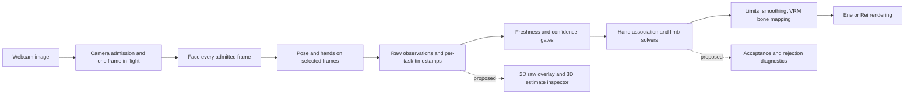

# VModel tracking research and diagnostic design

Date: 2026-10-04. Status: research and proposed design; no tracking behavior is changed by this document.

The first improvement should be visibility into the tracking pipeline. VModel already runs body and hand detection and already has limb solvers. The reported head-only movement can result from missing observations, slow or stale observations, rejected observations, or retargeting. Looking only at Ene cannot distinguish these. Build a camera overlay and an independent skeleton inspector before buying cameras or replacing the solver.

This audit inspected the current source and primary online documentation. It did not observe the user's webcam session, reproduce their movements, or establish a single root cause. “Confirmed” below means confirmed in source; “hypothesis” means a plausible explanation requiring measurement. Source line references describe the inspected implementation and may shift as the app evolves.

## What the app actually does

| Confirmed behavior | Why it matters | Source |
| --- | --- | --- |
| One worker runs Face, Pose Lite, then Hands synchronously; GPU initialization falls back to CPU. | A responsive renderer does not imply fast tracking. A slow task delays the whole frame result. | [tracking.worker.ts](../../src/tracking.worker.ts), lines 12–43 and 55–73 |
| Admission spacing is at least 50 ms in balanced and 100 ms in low mode, with one frame in flight. Pose/hands run every second/third admitted frame. | Ideal scheduling ceilings are approximately 20/10 Hz face and 10/3.3 Hz pose/hands respectively, before inference, bitmap creation, rendering cadence, and scheduling overhead. These are upper bounds, not measured performance. | [camera.ts](../../src/camera.ts), lines 73–98; [tracking.worker.ts](../../src/tracking.worker.ts), lines 57–67 |
| Samples retain their original acquisition timestamps when cached. The retargeter rejects samples aged 500 ms or more. | Fresh face results can coexist with stale cached body/hands. An inference result can arrive already too old. | [tracking.worker.ts](../../src/tracking.worker.ts), lines 60–73; [retarget.ts](../../src/retarget.ts), lines 17, 118–121, 147, 159–166 |
| A limb requires all three shoulder/elbow/wrist or hip/knee/ankle points to pass finite-value, visibility, and presence checks greater than 0.55. | A detected person is insufficient to drive an arm; one weak elbow discards that limb's goal. Missing confidence values default to 1, so absence of a field is not evidence of certainty. | [retarget.ts](../../src/retarget.ts), lines 9, 102–115 |
| Default mode is seated. Legs, standing pelvis motion, and root translation are conditional on standing. Arms are not conditional on standing. | Still legs/root can be intended behavior. Seated mode does not explain still arms. | [types.ts](../../src/types.ts), lines 34–36; [retarget.ts](../../src/retarget.ts), lines 132–145, 215–230 |
| Detailed hands require the hands setting, recent observations, hand-to-body association, and a valid palm frame. | A hand detector result can be present but rejected before fingers are driven. Wrist fallback can still use pose landmarks. | [retarget.ts](../../src/retarget.ts), lines 143–155; [retarget-math.ts](../../src/retarget-math.ts), lines 46–65, 89–139 |
| Each new frame clears goals and rebuilds them. Missing goals relax toward a fallback posture. | Repeated rejection can look like a permanently idle avatar rather than an obvious tracking error. | [retarget.ts](../../src/retarget.ts), `update`, goal rebuilding and missing-goal fallback |
| Head rotation is neutral-relative, clamped, then exponentially smoothed. Default response speed is 14. | Head stiffness can have a separate cause from missing limbs. Raising “Response speed” reduces smoothing lag; the variable name `smoothing` can obscure that direction. | [retarget-math.ts](../../src/retarget-math.ts), lines 30–38; [retarget.ts](../../src/retarget.ts), lines 11, 169, 183–200 |
| Worker output includes pose image/world landmarks and hand image/world landmarks, but discards face landmarks after deriving presence, blendshapes, and matrix. | Most of a neutral body/hand viewer is already supported. A face overlay needs an additional result field. | [types.ts](../../src/types.ts), lines 1–17; [tracking.worker.ts](../../src/tracking.worker.ts), lines 55–73 |

The existing “Face and body found” UI tests task presence/freshness, not accepted arm or finger goals. Its FPS is rendering FPS. The displayed inference time describes the most recent worker frame, which may skip pose/hands. Neither establishes effective limb update rate. See [main.ts](../../src/main.ts), the `getStats` hook and `seen`/status logic.

The historical [positive-photo report](../reports/tracking-positive-fixture.md) records warm full-task medians of roughly 104–156 ms on GPU and 255–351 ms on CPU for its selected still-photo cases. These make performance investigation worthwhile, but they are historical, unpaced, small-sample worker measurements without live camera, avatar rendering, or OBS. They do not validate physical motion or current-machine sustained throughput. Its fixed timestamp-overflow incident should not be presented as an unfixed current cause: the worker now supplies a session-relative SDK clock.

## Ranked hypotheses and discriminating experiments

Priority indicates investigation order, not a probability estimate.

| Priority / hypothesis | Evidence and uncertainty | Experiment that distinguishes it | Improvement if confirmed |
| --- | --- | --- | --- |
| 1. Camera framing, occlusion, or insufficient detail prevents usable limbs. | A face-close webcam can omit wrists, elbows, hips, or hands below a desk. Pose presence does not prove these individual landmarks are reliable. The actual camera view is unknown. | Overlay raw points and confidence while moving each visible arm separately. Compare face-close, seated upper-body, and standing full-body framing in good light; record actual capture dimensions. | Framing guidance based on missing joints, better camera position/light, and selective higher-resolution or region processing. Avoid requiring visible hips merely to animate a good arm. |
| 2. Body/hands are too slow or stale. | Source establishes lower cadence and a 500 ms gate; the historical report indicates substantial positive-detection cost. | Log acquisition-to-receipt age, unique sample timestamps, actual per-task Hz, delegate, p50/p95 inference duration, and stale-rejection fraction for 60 seconds. Compare balanced/low and renderer/OBS load. | Schedule by task deadlines and measured cost; retain bounded backlog, prioritize fresh limb samples, and profile before trying task parallelism. Raising the stale timeout alone merely displays older motion. |
| 3. Confidence and solver rejection conceal existing motion. | Three-point confidence gates and early `return`/`null` paths are confirmed. Actual rejection counts are absent. | Display each landmark even when rejected, plus the exact rejected joint and reason for every limb. Feed an identical recorded trace to the solver. | Tune thresholds with hysteresis and bounded loss recovery; retain conservative limits until false positives are measured. Do not globally lower thresholds to make the model move. |
| 4. Hand assignment/palm rejection suppresses fingers. | Assignment requires score ≥0.5; missing-pose-wrist fallback requires ≥0.85; distance cap is 0.18 image-height units, ambiguity margin 0.035. Nearly edge-on palms and degenerate bases are rejected. The caller does not pass the available association-history hint. | Show detector label, handedness score, candidate wrist distances, accepted owner, palm normal, and rejection. Cross hands, turn palms, and move one hand out of frame. | Add measured temporal association continuity, bounded reacquisition, and informative loss states. Test mirror/anatomical left-right explicitly rather than adding a blanket label swap. |
| 5. Smoothing, clamps, or calibration make head motion stiff. | Default angular limits are approximately ±37° pitch, ±63° yaw, ±29° roll times `headRange`; one response speed smooths all bones. At speed 14, the smoothing time constant is about 71 ms; reaching 90% of a fixed step takes about 164 ms, in addition to input latency. | Graph raw head orientation, neutral-relative target, clamped target, and applied orientation during slow turns and steps. Repeat with neutral recalibrated and higher response speed. | Separate dead range, saturation, filtering lag, and inference delay; consider channel-specific adaptive filters and clearer calibration feedback. `headRange` currently changes the clamp, not small-angle gain. |
| 6. 3D estimation, coordinates, or avatar rig/solver mismatch. | Monocular depth is estimated; solver plane limits can reject large changes. Required bones exist at load time, but that alone does not validate skinning, rest axes, optional finger bones, or each avatar's motion. | Compare raw 2D, estimated 3D, accepted solver targets, a canonical skeleton, then Ene/Rei on the same trace. Inject known bone rotations separately from tracking. | Fix the first diverging stage; preserve existing world-to-local parent handling. Avoid treating a replacement avatar or solver as proof that camera estimation improved. |

The limb solver limits flexion to 155°, uses history/rest planes near a straight limb, and rejects excessive plane changes (default 120°) and nearly fully folded observations. These are deliberate stability mechanisms and potential sources of suppressed movement when observations are noisy: [limb-solver.ts](../../src/limb-solver.ts), lines 62–102. A reason counter is more useful than assuming these limits are wrong.

The concurrent Rei integration provides a concrete rig-compatibility example: browser inspection found that Ene-oriented signed local-Z idle-arm offsets raised Rei's arms. The model integration work is correcting that narrow fallback using normalized rest directions. This is evidence that identical hardcoded bone offsets need not produce identical poses across avatars; it is not evidence that the camera missed the user's arms, nor a diagnosis of Ene's reported tracking failure. The layered inspector would distinguish such a fallback/mapping problem from absent observations.

## What established work suggests

| Work / primary source | Relevant technique | Implication for VModel |
| --- | --- | --- |
| [MediaPipe Pose](https://developers.google.com/edge/mediapipe/solutions/vision/pose_landmarker) | Standard 33-landmark body topology; Lite/Full/Heavy model variants. | Reuse its topology immediately. Benchmark Full against Lite only after separating detection quality from downstream rejection. A larger model can also worsen latency. |
| [MediaPipe Holistic architecture](https://chuoling.github.io/mediapipe/solutions/holistic.html) | Body-informed face/hand regions and recropping, with semantic consistency across components. | VModel's three independent Tasks are not automatically the same integrated pipeline. Explore coordinated crops/identity as an architectural experiment; this legacy guide is not a promise of a drop-in current Web API. |
| [KalidoKit](https://github.com/yeemachine/kalidokit) | Converts landmark observations into pose, face, and hand rig controls; includes a VRM example. | Useful comparison implementation separating estimation from rigging. Replay identical observations through it in a prototype; do not assume it removes camera ambiguity or provides production-ready legs. |
| [FreeMoCap calibration guide](https://github.com/freemocap/documentation/blob/main/docs/Writerside/topics/getting_started/multi_camera_calibration.md) | Overlapping camera views and ChArUco calibration establish relative camera geometry for reconstruction. | A multi-camera extension needs calibration and capture infrastructure, not merely another camera picker. |
| [OpenPose 3D documentation](https://github.com/CMU-Perceptual-Computing-Lab/openpose/blob/master/doc/advanced/3d_reconstruction_module.md) | Synchronized images, camera intrinsics/extrinsics, 2D keypoints, then 3D reconstruction and separate visualization. | Borrow the visibility of intermediate results. Its document says the module is not actively maintained, so use it as a reference architecture, not the default new dependency. |
| [Ultraleap tracking concepts](https://docs.ultraleap.com/api-reference/tracking-api/leapc-guide/leap-concepts.html) | Stereo image pairs, articulated hand bones, and estimation from model constraints/history when occluded. | A commercial tracking system also separates tracking structure from hand artwork. Even dedicated hardware estimates hidden parts; a smooth skeleton is not proof of direct observation. |
| [1€ Filter authors' reference](https://gery.casiez.net/1euro/) | Speed-dependent low-pass filtering balances stillness jitter and motion lag. | Candidate for measured per-channel filtering. Tune against recorded stationary and fast-motion clips; do not add filters blindly on top of SDK and avatar smoothing. |
| [VideoPose3D paper](https://arxiv.org/abs/1811.11742) | Temporal convolution uses a sequence of 2D keypoints to estimate 3D pose. | Time can improve a monocular estimate, but this is learned temporal inference, not a second simultaneous view. A browser deployment, skeleton mapping, and causal latency budget would need separate evaluation. |

## Single camera motion and multiple camera triangulation

One camera is enough to attempt useful face, upper-body, and hand animation. It is not enough to directly measure every hidden joint or determine arbitrary depth without assumptions. Two cameras can improve observability when both see a joint from different positions at approximately the same instant, their lens/pose calibration is known, and corresponding detections are correct. Two cameras do not fix a wrong rig or a stale scheduling pipeline.

The geometric distinction is that triangulation solves for the **same 3D point** from different projection rays. OpenCV's triangulation API takes two projection matrices and corresponding image observations; this explains the calibration and correspondence requirements. [OpenCV triangulation documentation](https://docs.opencv.org/doc/doxygen/html/d2/d48/group__d__projection.html).

In simplified notation, simultaneous cameras observe `u1(t) ~ P1 X(t)` and `u2(t) ~ P2 X(t)`. A fixed camera watching you move instead observes `u(t1) ~ P X(t1)` and `u(t2) ~ P X(t2)`. Your elbow's unknown position and your shoulder/elbow articulation may change between frames. Those equations do not constrain one shared static point in the same way. This is a geometric inference from the projection model, not a benchmark claim.

A camera moving around a stationary rigid object can provide multiple viewpoints for structure-from-motion; a purely rotating camera offers no translation baseline for ordinary depth triangulation. A rigid object moving with known relative motion can sometimes be described as equivalent camera motion. A person freely moving limbs supplies neither a static object nor known rigid transforms for the whole body. Non-rigid reconstruction, learned motion priors, and anatomical constraints can exploit video, but their extra assumptions must be acknowledged. Moving may expose a hidden hand in a later frame and help reacquisition; it does not reveal its exact earlier hidden pose.

For a future two-camera prototype, first capture synchronized or timestamp-aligned streams, estimate residual timing offsets, calibrate intrinsics/distortion/extrinsics with a board, match anatomical joints, triangulate only valid overlapping detections, and report reprojection error and missing-view states. Software-aligned consumer webcams still have exposure, rolling-shutter, driver-buffer, and synchronization uncertainty. Do not call them hardware-synchronized merely because their frame counts agree. Evaluate an external FreeMoCap-style recording pipeline before taking on simultaneous browser capture and calibration UX. Dedicated stereo hand hardware is an alternative only if finger quality remains the dominant requirement after software diagnosis.

## Proposed Tracking Inspector

### Representation and views

Use a standard MediaPipe skeleton, no VRM required. The user's first view is their camera image with body joints and bones, hands, and face contours. Keep an optional blank-background skeleton mode for privacy and clarity. The topology should come from the installed SDK's connection definitions and be recorded with the runtime/model version; do not invent a new joint ordering.

MediaPipe's Web pose result contains 33 image and world points; normalized image x/y use image width/height, while world points use meters with a hip-centered origin. Its optional segmentation mask gives person-pixel likelihood. [Pose Web result documentation](https://developers.google.com/edge/mediapipe/solutions/vision/pose_landmarker/web_js). Use those points for the overlay and 3D pane. The mask is an optional silhouette aid for framing and background separation; it does not identify individual bones or establish limb depth.

Face Landmarker provides 478 estimated face landmarks, 52 blendshape scores, and an optional face transform. [Face Landmarker documentation](https://developers.google.com/edge/mediapipe/solutions/vision/face_landmarker). Show contours by default, dense mesh optionally, orientation axes and selected expression bars. Do not fabricate per-point confidence where the SDK does not provide it.

Hand image results contain 21 points per hand with wrist-relative depth; world results have a hand-centered origin. [Hand Web result documentation](https://developers.google.com/edge/mediapipe/solutions/vision/hand_landmarker/web_js). Show a separate 3D hand pane initially. A composite skeleton may anchor `handPoint - handWrist` at the associated pose wrist, but label that placement as a derived alignment; it is not a shared measured global coordinate system. Pose world points, hand world points, normalized face depth, and the face transform must not simply be concatenated.

| Layer | Display | Question answered |
| --- | --- | --- |
| A: detector observations | Camera overlay with all returned points, joint indices/names on selection, confidence values when available, sample age, and left/right anatomy labels. | Did the tracker locate my elbow/hand/face correctly in the image? |
| B: estimated 3D | Orbitable stick figure with labeled axes, hip-centered origin, raw point positions, separate hand views, and no enforced constant bone lengths. | Does the estimated depth bend or flip even when 2D is good? |
| C: accepted motion | Optional canonical fixed-proportion stick skeleton, solver targets, clamp indicators, and before/after filtering traces. | Did gating, solving, constraints, or smoothing remove the movement? |
| D: avatar comparison | Ene or Rei beside the same observation and solver sequence; optional bone axes. | Is the remaining problem specific to mapping, rest pose, or skinning? |

“Raw” means unmodified SDK output, which may already contain model priors and SDK temporal processing; it does not mean sensor-measured ground truth. The UI should name layer B “Estimated 3D.” Layer C must remain optional because a clean constrained skeleton can hide errors just as an avatar does.

Use both color and line style/text: solid for accepted fresh points, outlined/dashed for low-confidence or rejected points, faded for stale data, and absent markers with a reason list for missing observations. Missing is not `(0,0,0)`. A sticky label can say “Right elbow rejected: visibility 0.31,” “Hands disabled,” or “Pose sample 620 ms old.” Keep anatomical side labels stable; apply mirror only to the displayed image and overlay together. Fit and letterbox from the actual frame dimensions, not the CSS rectangle.

### Data contract and implementation boundaries

1. Add a versioned, optional diagnostic envelope beside the production `TrackingFrame`. Include session ID, capture sequence/time, video media time, input dimensions, runtime/model identifiers, selected delegate, and per-task sample sequence, sampled/skipped/disabled state, timestamps, inference duration, and presence. Preserve cached sample identity instead of counting a repeated array as new inference.
2. Add `faceImage` observations only when the inspector or recording requests them. Retain pose/hand arrays before filtering. Keep absent confidence fields explicit as unavailable. Track per-task effective Hz and sample age at worker receipt, solver use, and rendering.
3. Return solver diagnostics with reason enums such as `low_visibility`, `low_presence`, `stale`, `ambiguous_hand`, `missing_bone`, `degenerate_segment`, `plane_jump`, `palm_edge_on`, `clamped`, and `disabled_by_mode`. Record which joint or stage caused the rejection. This requires instrumenting current silent returns, not deducing the cause from a still avatar.
4. Implement a dedicated `tracking-inspector` renderer using a 2D canvas plus the existing Three.js dependency for 3D. It consumes observations without loading Ene/Rei or creating a `Retargeter`. A separate solver adapter supplies layer C, and a VRM adapter supplies layer D. Proposed files are `src/tracking-diagnostics.ts`, `src/tracking-inspector.ts`, and `src/tracking-recording.ts`; these do not yet exist.
5. Align overlays with the actual sampled image. For an exact frozen inspection, retain a bounded sampled bitmap until its result arrives, or support offline replay. Drawing an old detection on the latest moving video must show its age; it must not be mistaken for localization error.
6. Add pause, single-step, layer toggles, and local trace export/import. Export a schema/model/settings/calibration manifest plus observation frames and diagnostic outcomes. Raw video capture is a separate explicit option, off by default, with a bounded duration and visible recording state. Default landmark export remains local and still contains movement data; no automatic upload or indefinite recording.
7. Keep inspector data out of the clean OBS output and avoid broadcasting dense face meshes/masks to the output window unless explicitly needed. Reuse inference rather than creating a second tracker. Bound buffers and release bitmaps/masks; benchmark enabled versus disabled overhead. No filter, cadence, or threshold changes should be hidden inside this feature.

### Experiments, metrics, and delivery order

Start with three recordings on the user's actual camera: a seated upper-body view, a standing full-body view, and a close face/hand view. For each, capture a brief still period, slow head turns, independent arm raises and elbow flexion, wrist pronation, finger opening/closing, crossed hands, a deliberate occlusion, and return to view. Include left/right identity checks with mirror on/off. Compare 640×480 and 1280×720 only when the camera actually supplies them. Use stable lighting and note camera, browser, device, delegate, active avatar, and OBS load.

| Metric | Measurement and interpretation |
| --- | --- |
| Observability | Fraction of frames where a manually visible joint is returned and usable; report each joint and framing separately. Do not score an intentionally hidden joint as directly observed. |
| Rejection/loss | Count each gate reason and duration of loss episodes; measure recovery time after a visible return. Separate detector absence from solver rejection. |
| Timing | Per-task unique-sample Hz; inference and capture-to-use p50/p95; stale fraction; renderer FPS separately. Browser timestamps approximate pipeline latency, not exposure-to-display latency. A recorded physical gesture and screen/high-speed-camera comparison is needed for stronger end-to-end measurement. |
| Jitter and range | Stationary angular/position variance; amplitude and lag of deliberate motions; raw, clamped, and applied curves. State the sample window and units. |
| Image accuracy | Manually annotate a small set of clear video frames and compare landmark pixel error normalized by image/person size. Report ambiguous/occluded points separately. |
| 3D quality | Depth flips, bone-length variation, and impossible configurations flag inconsistency. They do not establish metric accuracy; that requires an independent calibrated reference or ground truth. |
| Avatar independence | Replay exactly the same trace on the neutral skeleton, Ene, and Rei. Compare semantic joint motion rather than expecting identical silhouette or hand proportions. |

Proposed phases and exit criteria:

1. **Expose the pipeline:** ship layer A, task timing, and rejection reasons. Exit when a captured head-only episode can be classified by its failing stage, mirror/crop alignment is checked, and inspector-off inference behavior is unchanged.
2. **Make comparisons repeatable:** add pause/replay, raw estimated-3D views, and canonical solver view. Exit when the same trace reproduces acceptance/rejection decisions and anatomical sides across both avatars. Use synthetic inputs to verify contracts and transformations, real recorded/live inputs to judge motion quality.
3. **Fix the dominant measured failure:** try one intervention at a time: framing, cadence allocation, detector model size, association, then filter/solver parameters. Set numerical targets after measuring baseline; a provisional aspiration is ≥15 Hz useful upper-body updates and <150 ms median capture-to-use age on the target device, explicitly not a present capability or guaranteed requirement. Retain before/after clips and metrics, including regressions in difficult poses.
4. **Escalate sensing only if necessary:** pilot calibrated multi-view capture or dedicated hands when reliable monocular observations remain insufficient. Gate this on repeatable occlusion/depth failures, not on avatar aesthetics alone.

A useful first acceptance demonstration is simple: move one elbow while the camera overlay follows it; then show whether its 3D estimate, solver target, and avatar bone each follow. That localizes the failure and gives every later improvement a testable purpose.
