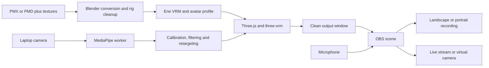

# Ene VTuber: proposal and implementation plan

Status: proposed; implementation has not started. Research and local inspection: 2026-09-12.

## Recommendation

Prepare **Ene Cyber legs**, the user's selected variant, in **Blender**, using **MMD Tools** to import the original character and **VRM Add-on for Blender** to export a portable `.vrm` avatar. Build a small **local web application** using TypeScript, Three.js, `@pixiv/three-vrm`, and MediaPipe Tasks Vision to animate that avatar from the laptop camera. Use **OBS Studio** for composition, microphone audio, recording, streaming, and virtual-camera output.

The user should eventually open a launcher, select Ene, enable the camera, calibrate, and choose a landscape or portrait output. Blender is an authoring tool used when preparing or repairing the avatar; it should not be required during a normal recording session. This is an avatar preparation workflow plus a purpose-built performance app, not a replacement for Blender.

This document completes the current planning request. Its [implementation backlog](../tasks/backlog/README.md) continues through delivery of both the rigged Ene avatar and a usable camera-to-video workflow.

## What we actually have

| Item | Verified finding | Consequence |
| --- | --- | --- |
| Repository | README, original brief, empty `src/`, motion, newly supplied Ene package and X excerpts; no application or repository-specific agent instructions found | New application and asset pipeline required |
| `ops/resources/ene.vmd` | 165,023 bytes; binary signature `Vocaloid Motion Data 0002` | This is motion data, not a character model |
| Motion metadata | Shift-JIS model-name field is `八雲紫(773)`; 1,405 bone keys, 387 morph keys; highest inspected bone frame is 348 | The embedded name differs from Ene; compatibility must be checked rather than inferred from filename |
| Motion integrity | Header and bone/morph sections inspected; later sections not fully validated | Do not call this a complete motion validation or derive clip duration from bone keys alone |
| Character assets | `ops/resources/ENE/` contains `ENE Normal legs ver.pmx`, `ENE Cyber legs ver.pmx`, textures and readmes; both signatures identify PMX 2.0 named ENE | The missing-model blocker is resolved; cyber legs is the user's selected baseline |
| Normal legs model | 63,964 vertices, 113,971 triangles, 50 materials, 193 bones, 50 morph entries | Preserve as an optional alternative; exporting it is not required for completion |
| Cyber legs model | 63,278 vertices, 112,949 triangles, 49 materials, 193 bones, 50 morph entries | Required delivery variant; budget material draw calls and texture memory on integrated graphics |
| Expressions | Both contain blink, left/right wink, smile and Japanese vowel morph names; `toon調整` occurs twice | Reuse existing shapes, validate visually, and identify duplicate names by stable index as well as name |
| Texture paths | Both have active sphere-map references to absent `s.bmp` and `spa-pi.bmp`; normal legs also references root `body01_s.bmp`, while `sph/body01_s.bmp` exists | Inspect and repair reflection maps or reproduce their appearance in MToon; no absent diffuse-map path was found in the material-reference check |
| Machine | Windows 11 Home Single Language, Intel i7-1255U, 15.6 GiB reported RAM, Intel Iris Xe graphics | Design for an integrated GPU; measure performance with OBS running |
| Tools | Python and Node/npm found on PATH; Blender not found on PATH | Inspect installed apps before installing; absence from PATH does not establish absence from the machine |

VMD SHA-256: `D3ABDEDF45E36A55AD66E2546EC0A562054DB8A6C11D4198FA8C6A773F39BEA8`.

Normal PMX SHA-256: `1B10578850B2EBD98A87F34099740A87C9589E3B8383AA2CEF38D285EF3DFCAB`.

Cyber PMX SHA-256: `226FE9075F25C7DD2E6474FDD6ACB77FF71C45900FB2D5C8794E08647AA9DBE4`.

The PMX inspection used bounds-checked binary reads through the morph section and checked referenced material texture paths. Geometry has not been rendered, weights have not been judged visually, and later physics sections have not been fully validated. Counts are evidence of existing data, not proof that the rig is production-ready.

MMD Tools explicitly distinguishes `.pmd`/`.pmx` model data from `.vmd` motion data. Renaming this file cannot turn it into a model. [MMD Tools documentation](https://github.com/MMD-Blender/blender_mmd_tools)

The user has stated that AuroraYok granted permission. Treat that as authorization for this project; record attribution and supplied asset terms, without requesting the same permission again. The bundled Ene readme credits editor `yokkaulove (DA)` and multiple contributors, permits edits and requests credit, and states no redistribution. Retain that name alongside the user's AuroraYok attribution rather than assuming the names are interchangeable. Other bundled readmes include upstream asset conditions. Keep the model, archive and conversion outputs local and out of the application distribution; application code and character assets have separate provenance. This planning work does not establish broader commercial or redistribution rights.

### Reference availability

| User reference | Research status | Planned use |
| --- | --- | --- |
| [AuroraYok Ene page](https://www.deviantart.com/aurorayok/art/MMD--ENE-NEW-VER.-DL!!!-433555045) | Fetch failed; page not verified; the user subsequently supplied the extracted PMX package | Use the supplied local package and its readmes |
| [YouTube example](https://www.youtube.com/watch?v=6egum-tZZbI) | Fetch throttled; video not viewed | Visual/movement reference once accessible; do not claim choreography or exact visual parity |
| [aiclass_g2](https://x.com/aiclass_g2/status/2096041288261140711?s=20) | Direct access denied; local excerpts supplied without individual post URLs | Use excerpts as user-provided reference material, without assigning authorship speculatively |
| [studio_yebisu](https://x.com/studio_yebisu/status/2097265681368850844?s=20) | Access denied | Same |
| [DreamyCat_Miyu](https://x.com/DreamyCat_Miyu/status/2097143600597565728?s=20) | Access denied | Same |
| [tegnike](https://x.com/tegnike/status/2097219959457763749?s=20) | Access denied | Same |

The supplied [x-posts.md](../resources/x-posts.md) contains three Japanese excerpts without individual post URLs; the third ends mid-workflow. The first points to AITuberKit for a character that talks and converses; the second describes substantial manual work in creating a 3D avatar; the third describes image/SVG generation and layered PSD preparation, suggesting a 2D route. These are summaries of the supplied text, not independently viewed demos or proof of their performance. No need to generate a new character or layered PSD when an existing rigged 3D Ene model is available.

AITuberKit's repository describes AI character conversation and VRM display, and says versions from 2.0.0 use a custom license. It is not selected as the core for this human-operated webcam project. AI conversation and autonomous streaming would be separate future features with their own dependency and service review. [AITuberKit repository](https://github.com/tegnike/aituber-kit)

## Proposal: alternatives and reasons

| Approach | Benefits | Costs / limitations | Decision |
| --- | --- | --- | --- |
| Blender to VRM + small local application | Reusable avatar, clear open source dependencies, tailored controls and recording workflow | One-time rig cleanup and custom retargeting work | Recommended |
| Drive PMX directly in a custom MMD runtime | Can retain more MMD conventions; potentially quicker first character display | MMD-specific IK, physics, morphs and loaders remain runtime concerns; less portable avatar | Contingency only if conversion loses essential appearance |
| Install XR Animator | Existing webcam motion-capture application; useful comparison | Its repository states CC BY-NC-SA for adapting source, with separate treatment of generated content; unsuitable as the foundation for this project's unrestricted open source code | Do not copy or embed its source; optional reference only |
| Build on KalidoKit / old Kalidoface tutorials | Existing landmark-to-rig examples | KalidoKit explicitly declares deprecation | Do not make it a core dependency |
| AITuberKit from the pasted post | Conversation-oriented character application with VRM support | Adds AI conversation scope and custom license conditions; does not remove Ene conversion and webcam-retargeting work | Reference only; no AI conversation dependency |

The Three.js r172 release removed the MMD modules, so examples assuming a current bundled `MMDLoader` are not a sound dependency plan. A direct PMX alternative would need a separately verified loader. [Three.js r172](https://github.com/mrdoob/three.js/releases/tag/r172)

XR Animator's stated source conditions and KalidoKit's deprecation were checked in their own repositories. [XR Animator](https://github.com/ButzYung/SystemAnimatorOnline#copyrightlicensecredits), [KalidoKit](https://github.com/yeemachine/kalidokit)

## Intended experience and scope

1. Run `Start VModel.cmd`; a local application opens in a tested Chromium browser.
2. Load the prepared Ene avatar. A sample avatar is available during development only, with its own suitable license.
3. Select the laptop camera and press Start camera. Raw camera preview is optional and confined to the control view.
4. Look straight ahead in a comfortable pose and calibrate. Select seated or standing mode.
5. Move the head, blink, speak, lean, raise arms, and wave. Visible hands drive wrists and fingers where the rig supports them.
6. Open a clean output window, select landscape or portrait, and capture that window in OBS.
7. Record with microphone audio, stream from OBS, or use OBS Virtual Camera in an application that accepts it.

The camera estimates motion and expressions; the renderer draws the avatar. It does not transform each camera pixel into an anime character.

### Required for completion

- **G1: Ene Cyber legs avatar.** Editable `.blend`, validated VRM 1.0 export with embedded textures, humanoid mapping, working blinks and mouth movement, stable deformation, and tuned hair/accessory motion where applicable. All final Ene acceptance and recordings use this variant.
- **G2: Performance program.** Local camera input; head, face, torso, arms, wrists and visible finger tracking; calibration and tracking-loss behavior; seated and standing modes; clean OBS output; a landscape recording with audio, a portrait MP4 with audio, and demonstrated virtual-camera output.
- Standing mode includes visible-body lean, arm gestures, knee bends, and small steps within the camera frame. Occluded legs fall back to a stable pose. This is a required milestone, not something silently deferred after delivering head tracking.
- The program has usable Start/Stop, Recenter, quality, background, framing, and expression controls, persistent settings, and a beginner quickstart.

### Limits and explicit extensions

A single laptop camera has blind spots and ambiguous depth. Seated framing cannot observe feet, crossed/hidden hands cannot be reconstructed reliably, and a dance video may contain authored animation or cleanup. Match recognizable Ene appearance and the user's live gestures first. Do not promise studio-quality dance capture or identical animation to the unviewed video.

VMD preview/retargeting is a separate, bounded compatibility task. Live camera tracking does not require the VMD. If it targets another skeleton, report unmatched channels and support a compatible test animation without treating the supplied motion as Ene's geometry. Exact reproduction of the YouTube choreography, a general motion editor, multi-camera tracking, custom virtual-camera drivers, mobile apps, and social-platform publishing automation are outside this release.

## Components and reproducibility

| Component | Role | Open source / selection notes |
| --- | --- | --- |
| Blender | Model repair and conversion host | Select a supported LTS release compatible with both add-ons; pin the tested build |
| MMD Tools | Import original PMX/PMD and inspect VMD | GPL-3.0; current repository documents Blender 4.2+ with its v4 line |
| VRM Add-on for Blender | Humanoid, expressions, MToon, export | Repository contains MIT/GPL notices; retain applicable notices for the selected distribution |
| Three.js + `@pixiv/three-vrm` | WebGL rendering and VRM runtime | MIT; pin compatible versions and use the runtime's humanoid/expression APIs |
| `@mediapipe/tasks-vision` | Face, body and hand inference | MediaPipe code uses Apache-2.0; separately record downloaded model artifacts and their terms |
| TypeScript + Vite | Small web app and production build | Pin exact resolved versions; avoid adding a UI framework unless needed |
| OBS Studio | Capture, microphone mix, encoder, virtual camera | GPL-2.0-or-later repository; install as a separate application |
| Test tooling | Retargeting and browser regressions | Vitest and Playwright candidates; pin after compatibility spike |

Authoritative component references: [MMD Tools](https://github.com/MMD-Blender/blender_mmd_tools), [VRM add-on](https://github.com/saturday06/VRM-Addon-for-Blender), [Three.js](https://github.com/mrdoob/three.js), [three-vrm](https://github.com/pixiv/three-vrm), [MediaPipe license](https://github.com/google-ai-edge/mediapipe/blob/master/LICENSE), [OBS](https://github.com/obsproject/obs-studio).

TASK-002 records exact versions, download URLs, checksums, licenses, and the supported browser/OS combination. This proposal does not pretend an untested version set is compatible. Use Blender's bundled Python for its scripts rather than assuming the system Python version works with Blender.

Runtime WASM and ML models must be installed locally with recorded checksums. Normal operation should not require CDN requests, a cloud inference account, or an API key. A first-run dependency download must be explicit and finish before offline operation is advertised.

## Architecture



### Avatar preparation

1. Preserve originals and create a source manifest. Inventory mesh, armature, morphs, materials, texture paths and attribution. Keep Japanese filenames intact.
2. Import `ENE Cyber legs ver.pmx` into Blender as the user-selected default; keep the normal variant unchanged for optional later conversion. Repair the known sphere-map paths, alpha modes, normals and scale before changing its rig. Locate or deliberately replace the effects of absent `s.bmp` and `spa-pi.bmp`; never silently substitute unrelated images. The separate normal-variant `body01_s.bmp` path issue is informational and does not block cyber delivery. Save reference views and a source `.blend`.
3. Build a verified MMD-to-humanoid mapping from the actual skeleton. Preserve weights where usable. Make the export skeleton's rest pose and axes consistent, resolving MMD helper/IK relationships without deleting bones that still influence vertices. Validate shoulders, elbows, wrists, hips and knees through a pose sweep.
4. Validate and map existing `まばたき`, `ウィンク左`, `ウィンク右`, `あ`, `い`, `う`, and `お` morphs into independent blinks and useful mouth shapes; repair geometry manually only where needed. Add useful emotion shapes when available. A full set of 52 face shapes is not a prerequisite. Preserve a mapping manifest from source indices/names to exported expressions, since names are not unique.
5. Translate materials to MToon, compare appearance, and recreate appropriate hair/accessory dynamics as spring bones and colliders. MMD physics should not be expected to survive unchanged.
6. Export VRM 1.0, validate required bones, expressions and embedded resources, and load it in the target runtime and a second independent VRM-capable viewer. Keep a reproducible conversion script plus documented manual corrections.

VRM defines a humanoid mapping and required bones; the Blender add-on supports scripted authoring. Those are interoperability mechanisms, not evidence that Ene can be converted without repairs. [VRM humanoid specification](https://vrm.dev/en/vrm1/humanoid/), [VRM add-on automation and tutorials](https://vrm-addon-for-blender.info/en-us/)

### Tracking and retargeting

The camera controller owns exactly one stream. It handles browser permission, busy/missing devices, resolution changes, stop/restart and disconnect. Use localhost rather than opening an HTML file directly. No microphone permission is needed in the app: OBS owns recording audio.

MediaPipe offers separate face, pose and hand tasks. Face output includes landmarks, expression coefficients and a transformation matrix; pose and hand outputs provide landmarks used by our own rig solver. These outputs still need calibration and mapping to Ene. Face inference is synchronous, so a worker is the starting architecture. [Face task](https://developers.google.com/edge/mediapipe/solutions/vision/face_landmarker/web_js), [Pose task](https://developers.google.com/edge/mediapipe/solutions/vision/pose_landmarker/web_js), [Hand task](https://developers.google.com/edge/mediapipe/solutions/vision/hand_landmarker/web_js)

Implementation requirements:

- Pass timestamped frames with one inference job in flight; drop stale frames, close transferred frame resources, and never build an unbounded queue. Benchmark worker GPU support; retain a tested CPU/WASM fallback.
- Maintain one canonical unmirrored coordinate convention. Preview mirroring changes presentation only. Validate left/right identity, axis signs, scale and camera aspect ratio with recorded fixtures.
- Recenter head orientation against a neutral calibration pose. Convert rotations through coordinate bases and parent-local rest transforms, using normalized humanoid bones where supported. Do not assign camera-space angles directly to arbitrary model bones.
- Face controls drive clamped blink and jaw/mouth weights. Calibrate range, smooth noise, and define expression priority so manual smiles, automatic blinks and mouth motion do not fight. Initial lip motion is visual jaw opening; do not claim phoneme recognition from the webcam.
- Pose segments drive torso and limbs using a constrained solver with explicit rest offsets, joint limits and bend-plane continuity. Preserve avatar proportions. Separate root movement from joint rotations; bound root movement in standing mode.
- Reconcile hand-task handedness with pose wrists. Use palm orientation and finger joint relationships with per-model limits. Resolve hand/arm overlap consistently. Fade unreliable channels independently to a comfortable idle pose.
- Blend to idle after approximately 0.5 seconds of missing input and ease back after reacquisition. Make thresholds configurable after measurement; clear old tracking state on camera changes and calibration.
- Assign one owner per channel: pose for body, hand solver for wrist/fingers when reliable, face for head/expressions, spring simulation for secondary bones. Motion-preview mode is mutually exclusive with live body control initially.

Proposed internal records: `TrackingFrame` (monotonic timestamp, face/body/hands and confidence), `CalibrationProfile` (device settings and neutral transforms), `AvatarProfile` (VRM hash, expression mappings, limits), and `PerformanceStats` (render/inference/queue timings). Save schemas with versions. Store settings locally; do not store raw video unless the user deliberately records a test fixture.

### Rendering, clean output and OBS

Use WebGL first. Provide controlled lighting, orbit/framing controls, a reset view, full-body and bust framing, and a background color selector. Offer 16:9 and 9:16 composition. Tune alpha-tested hair, outlines, and spring physics against the actual Ene asset.

The control page owns inference; the output window receives a timestamped avatar-state stream through a local same-origin channel and renders without acquiring another camera. Benchmark the extra rendering cost. A single-window clean-view mode is the low-power fallback, and remains sufficient for OBS capture. Keep the active output visible to avoid minimized-window throttling.

Primary OBS integration is **Window Capture** of a clean window with an opaque background, with optional chroma key. Choose a key color absent from Ene's actual textures; do not default blindly to green or blue. A transparent canvas alone does not guarantee alpha preservation through Windows capture. A separate OBS Browser Source/alpha transport is an optional later feature, not a hidden prerequisite. [OBS Window Capture](https://obsproject.com/kb/window-capture-sources)

OBS mixes microphone audio and records a recoverable format such as MKV before remuxing to MP4 where appropriate. Supply landscape and portrait profiles, a recording checklist, and measured encoder settings for this laptop. Virtual-camera output carries the OBS scene to a compatible destination; microphone routing must be configured separately. [OBS Virtual Camera](https://obsproject.com/kb/virtual-camera-guide)

Acceptance includes a local recording and a virtual-camera consumer check. Public streaming/publishing and entry of account credentials are not required to complete development. The portrait deliverable is intended for short-video upload; confirm platform-specific requirements when publishing instead of treating a fixed spec as permanent.

### Proposed repository layout

```text
src/                         # app, UI, camera, worker, retargeting, renderer, output
scripts/                     # setup, launcher support, Blender conversion, validation
config/avatars/               # non-sensitive mapping/configuration; no embedded model
tests/                       # synthetic and permissioned fixtures, meaningful regressions
public/runtime/              # locally provisioned WASM/ML files; tracked manifest
assets/source/ene/           # local original PMX/PMD package, excluded from code distribution
assets/work/ene/             # local editable Blender source
assets/avatars/ene.vrm       # local exported avatar
ops/resources/              # existing VMD and user reference material
ops/specs/                  # this proposal and implementation decisions
ops/tasks/backlog/          # numbered work items
ops/reports/                # asset audit, benchmark and acceptance evidence
docs/                       # beginner quickstart and troubleshooting
```

These are planned paths. Source files already in `ops/resources/` remain intact. Add ignore rules before generating local asset outputs and recordings. Do not expose the entire workspace through the local web server; serve only built app/runtime files and explicitly selected avatar data. Bind the server to loopback.

## Delivery stages and dependencies

| Stage | Tasks | Exit evidence |
| --- | --- | --- |
| 0: unblock and prove | 001-003 | Asset audit, pinned toolchain, sample-avatar feasibility measurements |
| 1: prepare Ene | 004-007 | Reproducible `.blend` and validated Ene VRM (G1) |
| 2: live performance | 008-013 | Face, body, hands, seated and standing behavior on the target laptop |
| 3: usable studio | 014-018 | Motion compatibility report, simple controls, clean output, OBS, portrait and landscape clips |
| 4: handoff | 019-021 | Launcher, offline checks, performance/recovery evidence, beginner acceptance (G2) |

The model package is now available. Asset cleanup and runtime work can proceed on separate dependency branches, using a licensed test avatar while Ene is being converted. Do not mark Ene delivery complete merely because a sample works. TASK-003 is an early performance gate before substantial polishing; if the baseline cannot run acceptably, measure lower inference resolution, CPU/GPU delegates and scheduling before reconsidering architecture.

Planning estimate: approximately **30-50 focused engineering/technical-art days**, with staged usable previews earlier. This is an estimate, not a benchmark or delivery promise. Missing texture repairs, substantial weight/shape repair, reference-driven scope changes, or difficult monocular body solving can increase it. Hardware capture checks require a person to perform the gestures; no camera was activated during planning.

## Acceptance and measurements

| Requirement | Completion evidence | Owning tasks |
| --- | --- | --- |
| G1-A identity | Ene reference views compared with imported and exported model; no missing textures or major unintended changes | 004, 007, 021 |
| G1-B rig | Required bones validated; head turn, arm raise, elbow bend, squat and finger pose sweeps do not collapse/invert the mesh | 005, 007 |
| G1-C expressions | Independent blinks and speaking motion; missing optional shapes explicitly listed | 006, 010 |
| G1-D portability | `.blend`, mappings, conversion instructions and VRM; second-viewer load; source provenance preserved | 007 |
| G2-A face and torso | Live head turn/nod, blink, mouth movement and torso lean follow the operator | 010, 011 |
| G2-B arms and hands | Both arm raises and waves; visible wrist/finger movement; graceful occlusion | 011, 012 |
| G2-C standing | Head-to-feet framing guidance, knee bends and small steps; bounded root, no explosive rotations, stable hidden-leg fallback | 013 |
| G2-D output | 60-second landscape and portrait recordings with audio; clean frame; virtual-camera consumer receives animated Ene | 016-018 |
| G2-E usability | Beginner can launch, load, calibrate, record, stop and restart from the quickstart | 019, 021 |
| G2-F robustness | Thirty-minute session, camera denial/disconnect and tracking reacquisition exercised; normal runtime works offline | 020 |

Proposed minimum performance gate on this laptop: **1280x720 landscape or 720x1280 portrait at 30 output fps**, with face+upper-body mode and OBS recording. Aim for median render rate at least 30 fps, 95th-percentile render frame interval at most 50 ms, and visible camera-to-avatar response within approximately 200 ms under normal lighting. Measure real end-to-end response using an external high-frame-rate recording of the gesture and display when available; internal inference timing alone is not equivalent. If unavailable, explicitly label end-to-end latency unmeasured and record the observable response test.

Standing+hands mode must be benchmarked separately. It may need 10-20 Hz inference interpolated into 30 fps output. Prefer lowering inference cost, shadows, pixel ratio and secondary physics while retaining useful motion. 1080p exports are stretch quality targets pending measurement. Record thermal behavior, dropped OBS frames, inference timing, memory after warm-up, and quality settings; no sustained memory growth or crash over the soak test. Missed gates require fixes or an explicit revised scope, not an unreported downgrade.

Use synthetic landmark fixtures for deterministic coordinate, smoothing, constraints and tracking-loss tests; keep camera-in-the-loop checks for actual model quality, latency and recording. Test timestamp handling, frame backpressure, malformed avatar failures, profile compatibility and cleanup. Avoid relying on screenshot tests as proof that live tracking works.

## Main risks and responses

| Risk | Response |
| --- | --- |
| Missing sphere textures and broken paths | TASK-001 finalizes the inventory; TASK-004 repairs or explicitly replaces the relevant material effects |
| VMD references a different model | TASK-014 checks channels and reports compatibility; do not make it a live-tracking dependency |
| Conversion loses MMD appearance or physics | Preserve source, compare views, author MToon/spring settings, repair rig manually when needed |
| Single-camera ambiguity | Confidence-aware constrained motion, seated/standing framing guidance, stable fallback; document observable limitations |
| Integrated GPU overloaded by inference, render and OBS | Early spike and final combined benchmark; reduce cost using measured quality presets |
| Dependency/API churn | Tested lockfile and downloaded-asset manifest; no deprecated tutorial pipeline |
| Face coefficients do not match Ene morphs | Avatar-specific expression mapping, calibration and missing-shape repair |
| Capture loses alpha or includes UI | Clean-window capture is the tested baseline; optional chroma key with a texture-safe color |
| Reference posts describe different products | Pasted text reviewed: retain human webcam performance scope; AI conversation and 2D character generation are separate extensions |

## Immediate implementation order

Start TASK-001 (finish the asset audit) and TASK-002 (toolchain), followed by TASK-003 (feasibility) and TASK-004 (Ene import). The character package and pasted X text are now present, so no model-acquisition blocker remains. Cyber legs is the user's selected baseline; both originals are preserved. Remaining tasks have concrete dependency and completion criteria in the backlog; all implementation work is still pending.
