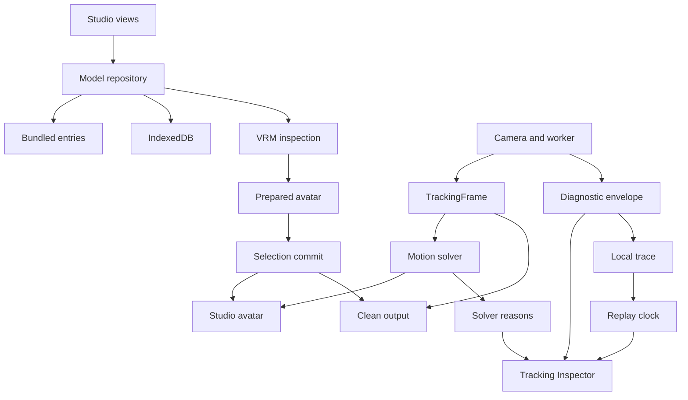

# Model library and Tracking Inspector action plan

Date: 2026-10-04. Status: defined design; implementation has not started.

Deliver two additions to the local studio. G5 is the persistent model library. G6 is the Tracking Inspector and measured tracking correction.

The [evaluation](../reports/studio-research-evaluation.md) explains the source findings. The [decision record](studio-design-decisions.md) selects the design. The [product specification](studio-product-spec.md) defines implementation and acceptance.

## Product outcome

A user can save a VRM, inspect its capabilities, select it safely, and recover it from a disk backup. A user can identify the first tracking stage that stops an intended movement. The studio must remain clear and visually consistent during these operations.

## Work sequence

| Step | Work | Output and exit condition |
| --- | --- | --- |
| 1 | Evaluate both research documents against the source. | Evaluation complete. Separate confirmed behavior from hypotheses. |
| 2 | Define the architecture and compare design choices. | Decisions D01 through D36 complete. Record conditional choices and their fallback. |
| 3 | Define product behavior and visual requirements. | Requirements L01 through L14, T01 through T17, and U01 through U08 complete. |
| 4 | Define implementation tasks and controllers. | TASK-039 through TASK-060 specify dependencies, work, acceptance, and evidence. |
| 5 | Build shared view contracts and model preparation. | TASK-039 and TASK-040 pass. Preserve current runtime behavior. |
| 6 | Build and verify the model library. | TASK-041 through TASK-048 pass. Hand G5 evidence to TASK-P01. |
| 7 | Expose tracking stages and repeatable traces. | TASK-049 through TASK-055 pass. Keep tracking parameters unchanged. |
| 8 | Diagnose live motion and test bounded corrections. | TASK-056 through TASK-059 supply physical evidence and an explicit correction verdict. |
| 9 | Verify the combined studio and complete handoff. | TASK-060 passes. TASK-021 consumes G5 and G6 evidence. |

Steps 1 through 4 form this planning delivery. Steps 5 through 9 form the implementation backlog.

The implementation sequence has independent entry points. TASK-039 and TASK-049 are Ready. Work on each task in dependency order. This plan does not request agent delegation.

Use the [interactive layout reference](studio-layout.html) to inspect the selected visual direction. Its sample content demonstrates layout, not implemented features or measured tracking.

## Software design

Keep the existing TypeScript, Three.js, three-vrm, MediaPipe, and Vite stack. Keep versions from `package.json` during the first implementation. Add no UI framework, cloud account, upload service, or database server.

The repository owns model identity and storage. The selection coordinator owns replacement of the active avatar. The viewer owns decoded graphics resources. The inspector owns its displays and local buffers.

The tracker owns observations. The solver owns rejection reasons. The trace recorder owns event order and replay time. Clean output receives only the existing performance data and committed model state.

## Controller scope

| Controller | Scope | Completion |
| --- | --- | --- |
| [TASK-P04](../tasks/backlog/TASK-P04.md) | G5; TASK-039 through TASK-048; shared visual rules | Library acceptance and TASK-048 handoff |
| [TASK-P05](../tasks/backlog/TASK-P05.md) | G6; TASK-049 through TASK-060 | Tracking acceptance and TASK-060 handoff |
| [TASK-P01](../tasks/active/TASK-P01.md) | Overall delivery; G1 through G6 | All implementation tasks and TASK-021 |

Controllers coordinate work. They are not prerequisites that must finish before their children start. TASK-P04 and TASK-P05 do not wait for TASK-021 to close.

## Changes to existing work

TASK-009 through TASK-013 retain their original physical acceptance requirements. New diagnostics can supply evidence for these tasks. Only their recorded acceptance determines completion.

TASK-015 retains everyday controls. G5 and G6 add dedicated views without replacing its current controls. TASK-020 remains archived with its historical evidence.

TASK-021 gains TASK-048 and TASK-060 as dependencies. Voice and website requirements remain separate. Planning completion does not change existing acceptance results.

## Measurement decisions

Use three 60-second measured runs after a 30-second warm-up for each performance comparison. Record computer, power, browser, model hashes, delegate, settings, and concurrent applications.

Use physical gestures for motion quality. Use synthetic data for boundaries and repeatable transformations. Never substitute one evidence class for the other.

Define import and memory baselines in TASK-047. Define tracking baselines in TASK-055 and TASK-056. Keep fixed correctness and resource ceilings from the specification throughout.

If a target cannot pass, record the result and the limiting stage. Keep the affected acceptance open. Do not silently lower the target or replace live evidence.

## Completion of planning

The planning package contains selected decisions, product requirements, detailed tasks, and two controllers. All new implementation acceptance boxes start unchecked. No feature implementation or live acceptance is claimed.

The [planning validation report](../reports/studio-planning-validation.md) records task, link, state-transition, and layout checks.
