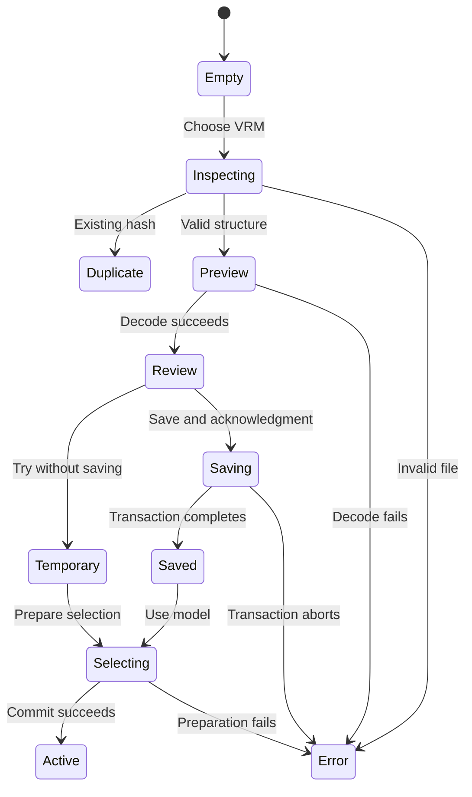

# Model library and Tracking Inspector product specification

Date: 2026-10-04. Version: 1. Status: ready for implementation.

This specification defines G5, the model library, and G6, the Tracking Inspector and measured corrections. It implements the [selected decisions](studio-design-decisions.md). The [action plan](studio-evolution-plan.md) defines the work order.

The intended user operates VModel on the existing Windows laptop. The user needs reliable model selection, visible motion faults, and a clear studio interface.

## Terms and authority

| Term | Meaning |
| --- | --- |
| Asset | Original VRM bytes, identified by SHA-256. |
| Entry | A library record with a stable ID and a display name. |
| Capability report | A record of supported bones, expressions, springs, and format. |
| Prepared avatar | Decoded graphics and a retargeter that have passed checks but are not active. |
| Retargeter | The component that applies solved motion to an avatar. |
| Diagnostic envelope | Optional data that describes tracker timing and observations. |
| Sample | One execution result from face, pose, or hand inference. |
| Trace | A bounded sequence of observations and application events for replay. |
| Canonical skeleton | A fixed reference rig that uses the same solver without a VRM. |
| Selection revision | A session counter that identifies a committed model change. |
| Baseline | A measured result before the proposed change. |

L requirements control the library. T requirements control tracking. U requirements control the interface. Each requirement maps to a task in the final table.

The research provides evidence, not additional release requirements. This specification takes priority where the research offers alternatives. Existing G1 through G4 acceptance remains in force.

## Scope and user flows

The application has three studio views: `Studio`, `Library`, and `Tracking`. View changes preserve the active camera, selected model, settings, and output session.

1. Open `Library`.
2. Select `Import VRM`.
3. Choose one file.
4. Inspect the preview, capabilities, and terms.
5. Acknowledge the displayed terms.
6. Select `Save to library`.
7. Select `Use model` when you want to change the active model.

For temporary use, select `Try without saving` after validation. The application marks the active model `Temporary`. It does not change the saved startup selection.

1. Open `Tracking`.
2. Start the camera if necessary.
3. Move one elbow.
4. Inspect its image point, estimated position, solver result, and avatar bone.
5. Select the first stage that does not follow the movement.
6. Record a trace if comparison is necessary.

Version 1 excludes cloud sync, model publication, MMD conversion, mobile certification, automatic model repair, multi-camera capture, and new voice features. It includes backup and optional local video evidence.

## Library requirements

### L01 Repository and identity

Add `src/model-repository.ts` and `src/model-types.ts`. Keep `src/avatars.ts` as the bundled catalog.

```ts
type ModelId = string;
type AssetHash = string;
interface ModelRepository {
  list(): Promise<LibraryEntry[]>;
  inspect(file: Blob, signal: AbortSignal): Promise<InspectionResult>;
  register(draft: RegistrationDraft, signal: AbortSignal): Promise<LibraryEntry>;
  resolve(id: ModelId, signal: AbortSignal): Promise<ResolvedAsset>;
  rename(id: ModelId, name: string): Promise<void>;
  remove(id: ModelId): Promise<void>;
  export(id: ModelId): Promise<Blob>;
}
```

Use `ene` and `rei` as bundled IDs. Use `crypto.randomUUID()` for imported IDs. Store lowercase SHA-256 hex strings. Calculate candidate hashes once, then verify stored bytes on each selection.

`LibraryEntry` contains identity, source, display name, original filename, metadata, capabilities, acknowledgment, and timestamps. `ResolvedAsset` contains the Blob, hash, entry ID, and label.

Keep display names from 1 through 80 Unicode code points after trim. Keep filenames as text. Never use an imported filename as a filesystem path.

Enforce one imported entry per hash with a unique database index. Check bundled hashes as well. A bundled duplicate offers `Use model` and shows its bundled identity.

An imported duplicate offers `Select existing` and `Rename existing`. Neither action writes duplicate bytes. Changed bytes create a new entry. Do not transfer calibration across hashes.

### L02 Database and atomic writes

Create IndexedDB `vmodel-library`, schema version 1, through `src/library-db.ts`.

| Store | Key and indexes | Required fields |
| --- | --- | --- |
| `assets` | `hash` | `blob`, `byteLength`, `mediaType`, `createdAt`, `validationVersion` |
| `models` | `id`; unique `assetHash` | `displayName`, `assetHash`, `sourceKind`, `originalFilename`, `vrmVersion`, `rawMeta`, `capabilities`, `acknowledgment`, `createdAt`, `updatedAt` |
| `attachments` | `id`; index `modelId` | `modelId`, `kind`, `originalFilename`, `mediaType`, `blob`, `sha256`, `encoding` |
| `preferences` | `key` | `value`; defined keys are `selectedModelId` and `schemaVersion` |

Keep thumbnails as attachment records with `kind: 'thumbnail'`. Save the asset, entry, thumbnail, and terms attachments in one readwrite transaction.

Finish hashing, decode, and user interaction before the write transaction. Wait for transaction completion before reporting success. A request success event alone is insufficient. [IndexedDB transactions](https://developer.mozilla.org/en-US/docs/Web/API/IndexedDB_API/Using_IndexedDB)

Abort on duplicate races, invalid drafts, or cancellation before commit. If cancellation arrives after commit, report the saved entry accurately. Never report cancellation as rollback after successful completion.

Close database handles on `versionchange`. Show `Close other studio tabs, then retry` for a blocked upgrade. Reject an unknown newer schema without clearing data.

### L03 Storage and startup

Use the normal launcher origin `http://127.0.0.1:4173`. The development origin has a separate library. `localhost` also differs from `127.0.0.1`.

Before save, display `navigator.storage.estimate()` results when available. Treat estimates as advisory. Handle `QuotaExceededError`, denied access, unavailable APIs, and transaction aborts.

After the first explicit save, request persistence once per session. Display `Persistent storage granted`, `Browser may remove saved data`, or `Storage status unavailable`. [Storage behavior](https://developer.mozilla.org/en-US/docs/Web/API/Storage_API/Storage_quotas_and_eviction_criteria)

If the database fails, keep bundled and temporary loading available. Explain that saved entries are unavailable. Do not clear the database automatically.

Read the saved library selection first. If absent, read the existing `vmodel-avatar` bundled selection. Do not rewrite settings or calibration keys.

If a saved entry is missing or corrupt at startup, load Ene and show the reason. During a running session, retain current decoded bytes after external deletion. Show that the entry is no longer saved.

### L04 Structural inspection and limits

Add `src/vrm-inspection.ts` and a worker for byte inspection and hashing. Reject unsupported input before graphics decode.

Check GLB version 2, declared length, chunk boundaries, four-byte alignment, JSON syntax, and exactly one supported VRM extension. Reject truncated, overlapping, or out-of-range data references.

Accept VRM 0 and VRM 1 through the pinned three-vrm loader. Reject external buffer and image URIs before decode. Allow embedded buffer views and bounded image data URIs only.

Keep a tested allowlist for required glTF extensions. Support the pinned loader's core VRM and material extensions. Reject unrecognized required extensions with their exact names.

Reject compressed geometry or compressed textures in version 1 unless preflight can calculate their decoded allocation. Do not fetch a remote decoder.

These are selected release ceilings, not measured laptop capacity:

| Resource | Maximum |
| --- | --- |
| VRM input | 150 MiB |
| GLB JSON | 8 MiB |
| JSON nesting depth | 64 |
| JSON values | 250,000 |
| Nodes / meshes / primitives / accessors | 20,000 / 4,096 / 8,192 / 32,768 |
| Image count | 256 |
| Image width or height | 8,192 pixels |
| Total decoded image pixels | 67,108,864 |
| Geometry allocation estimate | 128 MiB |
| Combined geometry and texture estimate | 512 MiB, including RGBA textures and mipmaps |
| User terms attachments | Eight per entry; 2 MiB each; 8 MiB total |
| Thumbnail | 320 by 320 pixels; PNG; 512 KiB |

Use checked arithmetic for accessor counts, strides, sparse data, and texture sums. Read image headers before full image decode. Reject unknown image formats with a clear reason.

Estimate allocations conservatively. Browser and driver overhead remain outside this estimate. Measure actual process memory in L13. If Ene or Rei exceeds a ceiling, record the incompatibility before changing this specification.

### L05 Capabilities and terms

Use the exact required-bone policy from `AvatarViewer.load`. Test hips, spine, head, arms, hands, legs, and feet. Preserve format orientation handling in the loader. [VRM format changes](https://vrm.dev/en/vrm1/changed/)

The capability report records missing optional bones, available expressions, resolved aliases, spring support, warnings, and validation version. Disable unavailable expression controls with a visible explanation.

Keep the existing `surprised` and Rei expression alias behavior. Do not invent an expression from a different morph. Preview neutral, smile, surprise, and relaxed arms when supported.

Preserve raw version-specific VRM metadata. Show embedded version and supplied package version as separate fields. Show original authorship and terms beside supplied attachments. [VRM metadata](https://github.com/vrm-c/vrm-specification/blob/master/specification/VRMC_vrm-1.0/meta.md)

Allow `.txt` and `.md` terms attachments. Display their contents as plain text. Preserve original bytes and encoding, including CP932. Offer encoding selection when the text cannot decode clearly.

Render metadata with text nodes. Permit external `https:` and `http:` terms links only after an explicit click. Use `noopener` and `noreferrer`. Reject script and data links.

Acknowledgment records `acknowledgedAt`, metadata digest, and attachment hashes. The checkbox text is `I have reviewed the displayed terms`. Conflicting or unknown terms remain visible after save.

### L06 Preview and resource ownership

Add `prepareAvatar`, `commitAvatar`, and `disposePreparedAvatar` boundaries in the viewer. Construct retargeter state before commit. Keep the old scene intact during preparation.

Allow one pending model operation per studio. Starting another operation cancels the previous operation. Each asynchronous stage checks an operation generation and `AbortSignal`.

Display named phases: `Inspecting file`, `Preparing preview`, `Ready to save`, and `Saving`. Do not show invented percentage progress for decode.

Use a 30-second preparation deadline. Late results cannot commit. Synchronous loader work may delay cancellation display. Dispose late graphics resources as soon as control returns.

Use a preview canvas with a maximum dimension of 512 pixels and a maximum rate of 30 FPS. Stop preview draws when hidden. Release preview resources before a separate active selection load.

Close bitmaps, revoke object URLs, remove observers, and dispose geometry, materials, textures, and renderers on every exit path. Do not keep library entries decoded.

### L07 Registration state machine



Cancellation before save returns to the library without an entry. Error text names the failed phase and an available recovery action. Retain the previous active avatar throughout failed imports.

Saving does not select. Retrying save must not create a duplicate. Clear the file input after inspection so the user can choose the same file again.

### L08 Selection and output

Add `src/model-selection.ts`. Resolve bytes, verify hash, prepare graphics, construct the retargeter, and load settings before commit.

Commit the prepared scene and application state synchronously. Increment the selection revision after success. Dispose the old scene only after the replacement becomes active.

Then persist the selected ID. If persistence fails, keep the successful active model and show `Selected for this session only`. Do not describe this as a failed model load.

Publish only committed selections. Add revision and session fields to output control messages. Output peers return `loading`, `ready`, or `error` with the revision.

An output peer keeps its previous model until the new model is ready. Ignore old acknowledgments and late loads. Show each connected peer's mismatch or error in the studio.

Use a 30-second output load deadline. A late result cannot commit. A peer can retry the latest revision. Studio success does not imply output success.

Keep clean output free of error panels, camera images, and diagnostic data. Existing heartbeat recovery and new-peer synchronization must continue to work.

### L09 Entry management

Allow rename for imported entries. Keep bundled names fixed. Disable removal for the active or currently requested local entry. Explain which model must change first.

Confirm removal with the entry name. Remove entry metadata and attachments in one transaction. Remove asset bytes only when no entry refers to the hash.

Keep hash-based settings after removal for later reimport. Document this behavior. Do not delete unrelated settings or calibration.

Notify other studio tabs of changes through a library channel. Database transactions remain authoritative. A tab refreshes its list after changes or focus recovery.

### L10 Original export

Export exact original VRM bytes on an explicit action. Verify the hash before download. Use a sanitized download name, without changing file bytes.

Export original terms attachments separately when requested. No export uploads data. A download does not establish redistribution permission.

### L11 Portable backup and restore

Add `src/library-backup.ts`. Use extension `.vmlib` and MIME type `application/octet-stream`. Do not add ZIP or compression dependencies.

The file starts with eight ASCII bytes `VMLIB1\r\n`. The next four bytes contain an unsigned little-endian manifest length. UTF-8 JSON follows, then binary segments.

The manifest contains `type: 'vmodel-library'`, `version: 1`, `createdAt`, `entries`, and `segments`. Each segment gives `id`, `kind`, `offset`, `length`, and `sha256`.

Offsets are relative to the payload start. Segments must be contiguous, nonoverlapping, and fully within the file. Require no trailing bytes. Hash every segment before writes.

Entries contain source ID, asset segment ID, display name, metadata, acknowledgment, capability version, and attachment segment IDs. Revalidate capabilities during restore.

Bound the manifest to 2 MiB, the complete file to 512 MiB, entries to 100, and segments to 1,000. Apply L04 limits to every restored asset and attachment.

Backups contain selected entries only. Include bundled bytes only when the user selects a portable backup for those entries. Explain the file size before download.

On restore, map an exact bundled hash to its bundled entry. If the installed bundle differs, restore the saved bytes as an imported entry. Never overwrite bundled files.

Validate structure, hashes, VRM preflight, and schema before the transaction. Decode and validate candidates sequentially. Dispose each candidate before the next one.

Show an import summary before restore. Generate new UUIDs for new entries. Keep existing entries on hash conflicts. Commit all new entries and attachments together.

Exclude camera calibration from backups. Offer an optional `Include model settings` checkbox, off by default. Include settings only for the selected hashes.

After database commit, apply validated settings to missing localStorage keys only. Never overwrite existing settings. Report settings failures separately from restored entries.

Restore never changes the active model. A corrupt or unsupported backup writes nothing. A settings failure does not roll back successfully restored assets.

### L12 Recovery and privacy

Keep private assets in browser storage or explicit disk downloads. Add no model uploads, remote thumbnails, analytics, or server write endpoint.

Provide recovery text for denied storage, full storage, missing bytes, blocked upgrades, newer schemas, and failed restore. Every recovery path retains bundled selection.

### L13 Library acceptance and performance

Test Ene, Rei, and a licensed VRM 1 fixture. Include missing optional expressions and one missing required bone. Record fixture source and hashes.

Test second visits, duplicate names and bytes, changed bytes, concurrent imports, malformed files, external URLs, and each allocation limit. Test cancellation at every asynchronous boundary.

Test output open, failed output decode, rapid selection, disconnected peers, and new peers. Verify separate settings and calibration for both avatars.

Run 20 alternating Ene/Rei selections after five warm-up selections. Track owned graphics resources and browser process memory. Require zero leaked owned resources after disposal.

Record import duration, first visible frame, peak memory, steady memory, and output recovery time. Test with output closed and open.

After cleanup, the final five memory samples must not exceed the first five median by more than 15% or 100 MiB, whichever is larger. If the browser cannot expose process memory, use the existing Windows process measurement. Heap alone is insufficient.

Require no renderer crash, blank committed avatar, or stale commit. Record absolute latency and memory baselines before later performance optimization.

### L14 Handoff

Provide a library guide with import, terms, selection, storage origin, backup, restore, and deletion procedures. Demonstrate restore in a new browser profile.

Keep original files outside the repository. Never describe browser storage as the only necessary copy. Supply acceptance evidence to TASK-P01 and TASK-021.

## Tracking requirements

### T01 Diagnostic contract and demand

Add `src/tracking-diagnostics.ts`. Keep `TrackingFrame.version: 1` and its existing meaning. Send diagnostics in a separate worker result field.

Use a diagnostic demand state: `off`, `inspect`, or `record`. Inspector and recorder share one tracker. Turning both off removes optional face arrays and image copies.

```ts
interface DiagnosticEnvelope {
  version: 1;
  sessionId: string;
  captureSequence: number;
  captureTimeMs: number;
  videoTimeMs: number;
  inputSize: { width: number; height: number };
  runtimeVersion: string;
  modelHashes: Record<'face' | 'pose' | 'hands', string>;
  delegate: 'GPU' | 'CPU';
  tasks: Record<'face' | 'pose' | 'hands', TaskDiagnostic>;
}
```

`TaskDiagnostic` includes `sampleSequence`, `captureSequence`, `sampleTimeMs`, `startedAtMs`, `finishedAtMs`, `state`, and `present`. Optional observations preserve exact SDK order and missing confidence fields.

Task states are `new`, `cached`, `disabled`, and `error`. A cached result retains its original sample identity and capture time. A disabled task cannot count as a new detection.

### T02 Clocks and metrics

Choose one main-thread epoch anchor per tracker session. Diagnostic times are milliseconds from that anchor. Translate worker `performance.timeOrigin + performance.now()` into that domain.

Retain the existing epoch timestamp for runtime freshness. Keep the short SDK timestamp introduced by the current worker. Never pass epoch milliseconds to `detectForVideo`.

Record receipt, solver-use, and display times separately. Reject results from another session or an older pending capture. Reset counters and histories on camera restart.

Calculate each task's effective Hz from distinct sample sequences in a rolling 10-second window. Show sample count and window duration. Show unavailable values when fewer than two samples exist.

Compute p50 and p95 using nearest-rank percentiles on recorded values. Report warm-up separately. Count rejected uses separately from rejected unique samples.

Preserve freshness boundaries: accepted age is at least -50 ms and less than 500 ms. Test -51, -50, 499, and 500 ms explicitly.

### T03 Solver reasons and parity

Instrument `retarget.ts`, `retarget-math.ts`, and `limb-solver.ts`. Return a result and diagnostic reasons from the actual decision path.

Reasons include `not_detected`, `missing_landmark`, `invalid_value`, `low_visibility`, `low_presence`, `stale`, `future_sample`, `disabled_by_mode`, and `disabled_by_setting`.

Also include `ambiguous_hand`, `hand_distance`, `hand_score`, `missing_bone`, `degenerate_segment`, `invalid_rest`, `invalid_parameter`, `fully_folded`, `plane_jump`, `palm_edge_on`, and `clamped`.

Each outcome names the stage, anatomical channel, sample ID, joint index when applicable, observed value, threshold, and acceptance state. `clamped` is an accepted result with a limit flag.

Use the first actual failing branch as the primary reason. Optional secondary facts must not invent checks that the solver did not execute.

Keep missing confidence values unavailable in diagnostics. Preserve the current runtime default of 1 during this phase. Show the applied default separately.

Record raw, neutral-relative, limited, and applied head orientation. Preserve current thresholds, fallback, solver order, and smoothing during instrumentation.

### T04 Camera overlay

Add `src/tracking-inspector.ts` with a 2D canvas. Use the installed SDK connection definitions for face, body, and hands.

Display all returned points, including rejected points. Show joint names and indices on selection. Show missing points as absent, never at the origin.

Fit images with `contain`. For container width W and height H, use scale `min(W/inputWidth, H/inputHeight)`. Center the resulting image rectangle.

Apply normalized x/y positions to that rectangle. Mirror both image and overlay once. Keep anatomical labels unchanged. Do not change solver coordinates for a display mirror.

Because cached tasks have different capture times, choose a task image: `Face`, `Body`, or `Hands`. Draw that task on its matched retained image.

Allow an optional combined live overlay. Label each task's age in this mode. Do not label combined cached observations as synchronized.

Retain at most four sampled images: three task samples and one pending capture. Close superseded images. If a matching image is missing, show landmarks on a plain background with a reason.

### T05 Estimated 3D

Use the existing Three.js dependency. Show pose world points without constant bone lengths. Label the view `Estimated 3D` and show meter units and axes.

For display only, map SDK coordinates `(x, y, z)` to `(x, -y, -z)`. Keep raw values available in the detail panel. Test this basis with known points.

Provide orbit, zoom, and `Reset view`. Provide separate left and right hand views. Hand depth and pose depth remain separate estimates. [Hand coordinates](https://developers.google.com/edge/mediapipe/solutions/vision/hand_landmarker/web_js)

Optional combined hands use `poseWrist + (handPoint - handWrist)` before the display transform. Label the result `Calculated wrist alignment`. Hide alignment when association fails.

Show face contours first. Make dense face points optional. Preserve actual runtime point counts and record versions. Do not fabricate face confidence. [Face results](https://developers.google.com/edge/mediapipe/solutions/vision/face_landmarker)

### T06 Canonical skeleton and avatar comparison

Extract shared motion calculation behind `MotionSolver`. Supply rest-rig data through an adapter. The canonical skeleton must not load a VRM or instantiate a VRM retargeter.

Keep one solver implementation for canonical and avatar adapters. The canonical rig has fixed proportions, named anatomical bones, and documented rest axes.

Use a T-pose reference in meters, with +Y up and +Z forward. Anatomical left lies on +X in the unmirrored front view.

| Reference point | Position or length |
| --- | --- |
| Hips / spine / head | `(0, 1, 0)` / `(0, 1.2, 0)` / `(0, 1.55, 0)` |
| Shoulder origins | `(±0.18, 1.45, 0)` |
| Upper arm / lower arm | 0.28 m / 0.25 m; extended outward |
| Leg origins | `(±0.11, 1, 0)` |
| Upper leg / lower leg | 0.42 m / 0.43 m; extended downward |
| Foot direction | +Z |

The adapter derives rest rotations from these directions. It must not reuse Ene-specific rotations. These dimensions define a visual reference, not a body measurement.

Offer layers `Observations`, `Estimated 3D`, `Accepted motion`, and `Avatar`. Only the last layer needs a model. A model load failure cannot prevent the first three layers.

Compare the same trace with Ene and Rei sequentially. Keep camera angle, trace time, settings, and calibration explicit. Do not expect identical silhouettes.

### T07 Live controls and output isolation

`Pause inspector` freezes the inspector display and its selected sample. Live tracking and clean output continue. `Resume` returns to the latest live sample.

Replay runs in a separate inspector solver and preview viewer. It never publishes frames or selection changes to output. Keep camera and replay controls visibly separate.

Clean output receives neither diagnostic envelopes, retained images, face point arrays, nor trace data. Test output messages as well as visible pixels.

### T08 Trace format and limits

Add `src/tracking-recording.ts`. Use UTF-8 JSON with `type: 'vmodel-trace'` and `version: 1`. The manifest records runtime, models, solver version, settings, calibration, and rig hashes.

Record ordered `sample`, `apply`, `settings`, `calibration`, and `reset` events. Each event has a sequence and session-relative time.

`sample` events contain raw observations, original sample IDs, and recorded reasons. `apply` events contain frame reference, solver-use time, and render delta time.

Record distinct samples once. Do not expand cached arrays for every render event. Preserve the initial state and each later settings or calibration change.

Limit a trace to 60 seconds, 1,800 capture events, 7,200 apply events, and 32 MiB of encoded data. Stop at the first limit. Retain the valid prefix and show the reason.

Bound in-memory arrays as well as exported bytes. Do not create an unbounded string before testing the size. Keep at most one trace and one replay trace in memory.

Export only after an explicit action. Default exports contain no camera images, device IDs, absolute local paths, or video. Explain that landmarks still describe personal movement.

### T09 Trace validation and replay

Reject unknown schema versions, invalid event order, missing sample references, oversized arrays, non-finite values, and unexpected object fields. Enforce the T08 limits during import.

On replay start, reset solver history, calibration, and settings from the manifest. Drive all age checks and smoothing with recorded times and deltas.

For seek or backward step, reset and replay from the beginning to the requested event. Do not jump into a stateful solver without its history.

Require identical reason enums and accepted-channel sets on repeated replay with the same build. Require quaternion angular differences no greater than 0.0001 radians.

For another solver version, label the session `Comparison`. Show stored and recomputed outcomes separately. Do not claim deterministic equality across versions.

Landmark-only replay shows a plain background. Optional recorded video uses its recorded timestamp mapping. Never show the current camera behind an old trace without a clear live label.

### T10 Optional video evidence

Provide a separate `Record camera video` checkbox, off by default. Show a visible recording state and stop control. Do not request audio.

Use `MediaRecorder` only when the browser supports the selected type. Save video as a separate local file. Record start offset, stop offset, MIME type, and trace ID.

Limit video to 60 seconds or 64 MiB, whichever occurs first. Stop on camera loss or recorder error. Retain a valid partial file when possible.

If video recording is unavailable, keep trace recording available. Explain the limitation. Video is necessary only for image-error annotation and direct physical comparisons.

### T11 Data retention and lifecycle

Keep live metrics in a 10-second ring buffer. Keep paused data within the trace limits. Close images and release 3D resources when their view closes.

Clear unsaved traces on application close. Warn before discarding a recorded trace through an in-app action. Make no automatic filesystem save or network transfer.

Use private `ops/reports/local/` paths for implementation recordings. Commit only aggregate measurements and synthetic fixtures that contain no personal movement.

### T12 Diagnostic performance

Limit overlay and 3D updates to 30 FPS. Update numeric summaries at 4 Hz. Draw only the visible inspector layer. Disable dense face points initially.

Compare inspector off, 2D overlay, estimated 3D, and recording under identical settings. Run three 60-second samples after 30 seconds of warm-up.

With diagnostics off, require the same inference schedule and solver results as the baseline. Require no more than 5% loss in task Hz or renderer FPS.

With the default inspector on, require at most 10% loss in useful pose Hz and renderer FPS. Require at most 20 ms additional p95 capture-to-use age.

Require no unbounded memory growth, extra camera instance, inference backlog, or output data leak. Record dense-face and video costs separately. These optional modes cannot establish default-mode performance.

### T13 Physical diagnosis protocol

Test seated upper body, standing full body, and close face with hands. Use the camera's actual dimensions. Compare 640 by 480 and 1280 by 720 only when supported.

For each view, record 10 seconds still, then deliberate movements. Include head turns, separate arm raises, elbow flexion, wrist rotation, and fingers.

Include crossed hands, occlusion, and return to view. Test mirror on and off. Record camera placement, light, delegate, model hashes, browser, power, and OBS state.

Annotate at least 30 clear frames per tested view when video is available. Separate visible, hidden, and ambiguous joints. Normalize image error by the frame diagonal.

Identify the first failing stage for each reproduced symptom. If the reported head-only symptom does not recur, record that result and the tested conditions.

Unavailable physical tests remain open. A synthetic trace or still photograph cannot close this requirement.

### T14 Scheduling experiment

Only a timing fault established by T13 enables scheduler changes. Keep one frame in flight and no inference queue.

Test per-task deadlines with a cost estimate from the last 30 executions. Use initial target periods of 50 ms face and 67 ms pose/hands. These are experiment inputs.

Run overdue tasks by earliest deadline on the latest admitted image. Retain sample identity for skipped tasks. Do not run disabled hands.

Keep CPU fallback, watchdogs, and the 500 ms freshness gate. Compare against the unchanged scheduler using T16. Revert if the correction fails.

Do not add task parallelism, Pose Full, Holistic, or a different solver in this task. Those options require a separate measured proposal.

### T15 Motion correction experiments

If association is the cause, test the existing history hint with a 250 ms expiry. Clear history on restart, loss beyond expiry, or mirror-independent identity change.

Never force ownership when observations remain ambiguous. Test crossed hands and one missing hand. Preserve the distance and confidence gates unless an isolated experiment supports a change.

If smoothing is the cause, first compare current response speeds 14, 20, and 30. Compare raw, limited, and applied orientations. Keep settings compatible.

If those settings cannot pass, test one adaptive filter in a separate branch. Do not stack it on the existing filter. Record its formula and parameters before comparison.

Use the 1€ filter as that candidate. Its speed-dependent cutoff balances jitter and delay. [Authors' reference](https://gery.casiez.net/1euro/)

For this experiment, filter neutral-relative head Euler angles in XYZ order, in radians. Unwrap angles and update only on new face samples. Keep the existing head limits.

Start with `minCutoff = 1.5 Hz`, `beta = 0.5`, and `derivativeCutoff = 1 Hz`. Test minimum cutoffs of 1, 1.5, and 2 Hz.

Test beta values of 0.25, 0.5, and 1. Keep derivative cutoff fixed. Reset filter state on calibration, restart, or face loss beyond 500 ms.

Replace the existing head smoothing only within this candidate. Preserve other channels. Use actual sample intervals and the authors' filter equations.

If confidence rejection is the cause, test per-channel hysteresis against visible and occluded joints. Do not lower the global threshold without false-positive evidence.

The initial candidate enters acceptance above 0.60 and retains acceptance above 0.50. Require two consecutive valid samples to enter. Reject immediately below the retention threshold.

Apply that candidate only to the diagnosed limb. Retain finite-value, freshness, and missing-point checks. Restore the baseline if T16 fails.

If rig mapping is the cause, repair only the first incorrect coordinate or rest-rig conversion. Verify known anatomical rotations before physical comparison.

Do not add an avatar-name condition for a general mapping error. Preserve parent-first world-to-local conversion and format orientation handling.

Retain current behavior if no candidate passes T16. Add camera guidance when the evidence identifies framing or light as the cause.

### T16 Correction acceptance

Select the metric from the first failed stage before each experiment. Use the same traces and three live repetitions for baseline and candidate.

| Failure | Required improvement |
| --- | --- |
| Timing | At least 20% more useful pose samples, or at least 20% lower p95 age |
| Rejection or loss | At least 20% less rejected visible-joint time, or at least 20% lower p95 recovery time |
| Jitter | At least 20% less stationary angular variance |
| Lag | At least 20% lower median motion lag without range loss |
| Wrong mapping | Correct anatomical side and expected rotation in every named regression fixture |

Require no more than 10% regression in unselected timing, jitter, recovery, and renderer metrics. Require no new wrong-side event or invalid bone transform in the test set.

For zero or near-zero baselines, report absolute units and use the named correctness cases. Do not calculate a misleading percentage improvement.

Report the research targets of at least 15 Hz useful upper-body updates and less than 150 ms median capture-to-use age. These targets do not override correctness.

If no correction passes, keep the baseline and document the limit. G6 may close with a verified diagnostic tool and an evidence-backed sensing limit. A confirmed software defect remains open until fixed or explicitly removed from scope by the user.

### T17 Tracking and combined handoff

Demonstrate one elbow through all four layers. Replay the same trace against the canonical skeleton, Ene, and Rei. Preserve separate live and synthetic results.

Document camera guidance, trace procedures, privacy controls, measurements, correction verdicts, and sensing limits. Complete the combined library and tracking checks before TASK-060 closes.

Require clean output during import preview, inspector pause, replay, and model changes. Verify recovery after camera loss, storage failure, and output reload.

## Interface and aesthetic requirements

### U01 Visual system

Extend the current dark studio design. Use quiet backgrounds, clear labels, and one primary action per panel. The avatar or diagnostic view remains the main visual element.

| Token | Value |
| --- | --- |
| Page / panel / raised surface | `#0C1220` / `#101827` / `#192337` |
| Main text / secondary text | `#E4EAF5` / `#A9B8CF` |
| Accent / accent text | `#60DCEA` / `#0B2932` |
| Accepted / warning / failure | `#7CE1BE` / `#FFD18A` / `#FF9DAD` |
| Border / focus | `#41516D` / `#66E4EF` |
| Spacing | 4, 8, 12, 16, 24, 32 pixels |
| Corner radius | 8 pixels for controls; 12 pixels for panels |
| Font | Existing local system stack; no font download |
| Type | 14 pixels body; 12 pixels secondary; 20 pixels panel title; 28 pixels view title |

Avoid decorative gradients, repeated shadows, novelty type, and automatic avatar rotation. Use tabular numerals for metrics. Keep original avatar textures and lighting intent.

### U02 Layout

At widths of at least 1,200 pixels, use a 240-pixel navigation column and a flexible content area. Detail panels use 320 pixels when open.

From 768 through 1,199 pixels, use top navigation and collapsible details. Below 768 pixels, stack panels in reading order. Preserve touch and keyboard access.

Require usable layouts at 390 by 844, 768 by 1024, and 1440 by 900. Narrow layouts are interface coverage, not mobile tracking certification.

### U03 Library composition

Place title, saved-model count, and `Import VRM` above the grid. Show storage status below the title. Use three, two, or one card columns as space permits.

Each card shows a square thumbnail, name, source, capability summary, and selected state. Keep thumbnails on the same neutral background with consistent headroom.

Use `Use model` as the card action. Put rename, export, and remove in a labeled menu. Keep bundled and imported entries visually consistent.

The import panel places preview beside details at wide sizes. Stack preview before details at narrow sizes. Show capabilities before terms and save controls.

### U04 Tracking composition

Place camera state and `Pause inspector` above the main view. Put layer controls directly above the canvas. Place selected-joint details beside or below it.

Keep the failure reason visible near the affected channel. Show summary rows for Face, Body, Left hand, and Right hand. Put distributions and raw values in details.

Use a solid line plus `Accepted`, a dashed line plus `Rejected`, and a faded line plus `Stale`. Use an absent marker plus `Missing` for unavailable points.

Keep anatomical side labels stable. Do not use color alone to show state. Do not make the canonical skeleton more visually prominent than raw evidence.

### U05 Interaction and accessibility

Provide keyboard access to navigation, cards, menus, layers, and joint selection. Trap focus in modal dialogs. Return focus to the control that opened the dialog.

Use visible focus, explicit labels, and error text associated with the relevant field. Announce state changes through a polite live region. Announce blocking failures immediately.

Require 4.5:1 contrast for normal text and 3:1 for large text and essential graphics. Check each actual color pairing. [WCAG 2.2](https://www.w3.org/TR/WCAG22/)

Use at least 44 by 44 CSS pixels for primary touch targets. Preserve access at 200% zoom. Provide buttons for essential orbit and zoom functions.

### U06 Motion and loading

Use transitions from 120 through 180 ms for panel state changes. With reduced motion, remove transitions and automatic preview motion.

Show phase text and a progress indicator during work. Keep cancellation visible before commit. Do not move controls when a message appears.

### U07 Required states

Capture visual evidence for empty library, bundled-only library, saved entries, duplicate, inspection error, preview, terms conflict, quota failure, and output mismatch.

Also capture camera stopped, permission failure, valid tracking, low confidence, stale sample, disabled hands, paused inspector, replay, and trace limit reached.

Use real Ene and Rei previews for model appearance checks. Generic icons cannot establish avatar aesthetics. Check neutral pose, relaxed arms, face framing, and expression differences.

### U08 Visual acceptance

Require no clipped labels, overlapping controls, unreadable values, unexplained disabled controls, or horizontal page scroll at the required sizes.

Compare screenshots against the selected tokens and layout. Check keyboard order and reduced motion. Record a human visual review of model framing and diagnostic clarity.

Record the reviewer's findings and repairs. A screenshot file alone does not establish visual acceptance. The [layout reference](studio-layout.html) is a specimen, not runtime evidence.

## Requirement ownership

| Requirements | Primary implementation tasks | Verification or handoff |
| --- | --- | --- |
| L01 | TASK-039, TASK-041 | TASK-047 |
| L02, L03 | TASK-041 | TASK-047 |
| L04, L05 | TASK-040, TASK-042 | TASK-047 |
| L06, L07 | TASK-040, TASK-043 | TASK-047 |
| L08 | TASK-044 | TASK-047, TASK-060 |
| L09 | TASK-045 | TASK-047 |
| L10, L11 | TASK-046 | TASK-047 |
| L12, L13 | TASK-047 | TASK-048 |
| L14 | TASK-048 | TASK-021 |
| T01, T02 | TASK-049 | TASK-055 |
| T03 | TASK-050 | TASK-054, TASK-055 |
| T04 | TASK-051 | TASK-055 |
| T05 | TASK-052 | TASK-054 |
| T06 | TASK-054 | TASK-055, TASK-060 |
| T07 | TASK-051, TASK-054 | TASK-060 |
| T08 through T11 | TASK-053 | TASK-055 |
| T12 | TASK-055 | TASK-060 |
| T13 | TASK-056 | TASK-059 |
| T14 | TASK-057 | TASK-059 |
| T15 | TASK-058 | TASK-059 |
| T16 | TASK-057, TASK-058, TASK-059 | TASK-060 |
| T17 | TASK-060 | TASK-021 |
| U01 through U03 | TASK-039, TASK-045 | TASK-047 |
| U04 | TASK-051, TASK-052 | TASK-055 |
| U05, U06 | TASK-043, TASK-045, TASK-051, TASK-053 | TASK-047, TASK-055 |
| U07, U08 | TASK-047, TASK-055 | TASK-060 |

## Release evidence

Require `npm test` and `npm run build` after runtime changes. Run existing verification when integration changes affect bundled models, output, camera, or privacy.

Use focused fixtures for parser boundaries, transaction rollback, stale generations, clocks, coordinate transforms, and replay. Use browser tests for IndexedDB and actual view behavior.

Use the current Windows Chrome and Edge installations for release acceptance. Record exact versions. Firefox is a diagnostic compatibility check. Safari and mobile remain outside release claims.

Every task records changed files, commands, results, report paths, and missing evidence. No controller may close from document creation alone.
